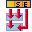

# Alberto Cruz
  <http://docos.fi>
  <nospam+alberto.cruz@docos.fi>

## <a href='./components/tSplitTimeRange/readme.md'> tSplitTimeRange</a>
 :warning: Compatibility not known

Use this component to split incoming row containing start and end datetimes by hour. Output will multiply input row into chunks of one hour (or less in case of start and end time).

