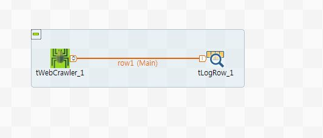

## tWebCrawler

### Overview
This component is dedicated for crawling HTML content from website.
you can config that component be needed option field such as "Search Engine", "Crawling URL", "Webpage keyword pattern", "Crawling depth", "Crawling Duration", "Save HTML"... etc in Basic settings.
you can set Advanced setting where, from this tab, you are select varius option to improve tWebCrawler component.
you can connect crawling result to other component as output connection that able to be accepted to process data. Through doing this, you are able to process crawling data for what you need to processing.
During component is running, Crawler component collect web content and deliver content to connected other components.
Output schema setting is able to process what you want to.

Output of crawling schema is involved inforamtion of follows.

URL - crawling URL
KEYWORD - keyword from user
MATCH - match count in content
HTML - collected HTML page
TEXT - extract text from HTML page
COOKIE - cookie of collected HTML
CHARSET - charset of HTML page
FILENAME - filename of HTML
LAST_MODIFIED - lastmodified value of HTML header
CURRENT_DATE - timestamp of time of crawling HTML

### Details
1. Search Engine(Wiki/Nature Mag/Time Mag/People Mag/Google/Bing/twitter/Naver/Daum) result crawling, able to be crawling by that.
2. You can configure crawling depth and duration. (Depth is sub level of webpage link. if all of depth of wepage is collected, crawling over)
3. You can use Java regex pattern in keyword pattern.
4. All of result of crawling can saving to specific folder.
5. This component can supports multi-thread crawling. You can set thread count when will be used thread on crawling.(It's very speedy and high-performance way to crawling)
### Images

### Install Instructions
1. Download zip compressed file.
2. Decompress zip file on temporary folder.
3. Copy all decompressed files to TOS components folder
4. Restart TOS and check Palette view
5. Use Crawler component for your Job.
### Resources
 * <a href=http://www.chaostocosmos.org/>Author's page.</a>

#### Release Notes

##### 0.9 - 2018-08-22 06:09:08
Current version 0.9
Some limitation exists.

### Compatible
 -  5.0 (obsolete)
 -   5.1 (obsolete)
 -   5.2 (obsolete)
 -   5.3 (obsolete)
 -   5.4 (obsolete)
 -   5.5 (obsolete)
 -   5.6 (obsolete)
 -   6.0 (obsolete)
 -   6.1 (obsolete)
 -   6.2 (obsolete)
 -   6.3 (obsolete)
 -   6.4 (obsolete)
 -  6.5 (retired)