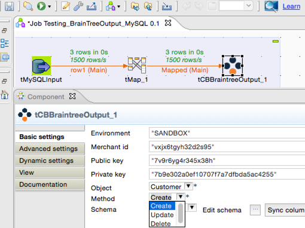

## tCBBrainTreeOutput

### Overview
This ActiveCampaign Output component creates new items and updates existing data in Activecampaign e-marketing cloud service.
You can import data to many BrainTree modules (like Customers, Transactions etc).

<h2>&nbsp;&nbsp;&nbsp;&nbsp;<a href="http://cloudbee.com/braintree-talend-component/?utm_source=talendexchange&utm_medium=listing&utm_content=braintree&utm_campaign=braintree_comp_talendexchangelisting"><strong>Plans & Pricing >></strong></a></h2>
 
 
 
### Details
 
<h2>&nbsp;&nbsp;&nbsp;&nbsp;<a href="http://cloudbee.com/braintree-talend-component/?utm_source=talendexchange&utm_medium=listing&utm_content=braintree&utm_campaign=braintree_comp_talendexchangelisting"><strong>Features Info >></strong></a></h2>
  
### Images

### Install Instructions
Download component files from http://cloudbee.com Client Area and copy to Talend custom components folder
### Resources
 * <a href=http://cloudbee.com/braintree-talend-component/?utm_source=talendexchange&utm_medium=listing&utm_content=braintree&utm_campaign=braintree_comp_talendexchangelisting>Read More >></a>

#### Release Notes

##### 1.0 - 2015-04-12 11:18:42

### Compatible
 -  5.4 (obsolete)
 -   5.5 (obsolete)
 -   5.6 (obsolete)
 -   6.0 (obsolete)
 -   6.1 (obsolete)
 -   6.2 (obsolete)