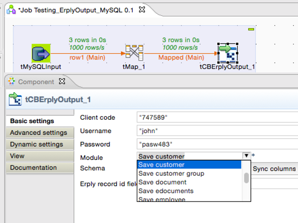

## tCBErplyOutput

### Overview
<h4>Erply components with advanced features</h4>
 
<h3>&nbsp;&nbsp;&nbsp;&nbsp;<a href="http://cloudbee.com/erply-talend-component/?utm_source=talendexchange&utm_medium=listing&utm_content=erply&utm_campaign=erply_comp_talendexchangelisting">Plans & Pricing >></a></h3>

<h5>Features</h5>
<ul>
<li>Filter by values</li>
<li>Sort by values</li>
<li>Pagination</li>
 
</ul>
### Details
 
<h2>&nbsp;&nbsp;&nbsp;&nbsp;<a href="http://cloudbee.com/activecampaign-talend-component/?utm_source=talendexchange&utm_medium=listing&utm_content=activecampaign&utm_campaign=activecampaign_comp_talendexchangelisting"><strong>Plans & Pricing >></strong></a></h2>
  
### Images

### Install Instructions
Download component files from http://cloudbee.com Client Area and copy to Talend custom components folder
### Resources
 * <a href=http://cloudbee.com/erply-talend-component/?utm_source=talendexchange&utm_medium=listing&utm_content=erply&utm_campaign=erply_comp_talendexchangelisting>Read More >></a>

#### Release Notes

##### 1.0 - 2015-04-12 11:35:35

### Compatible
 -  5.4 (obsolete)
 -   5.5 (obsolete)
 -   5.6 (obsolete)
 -   6.0 (obsolete)
 -   6.1 (obsolete)
 -   6.2 (obsolete)