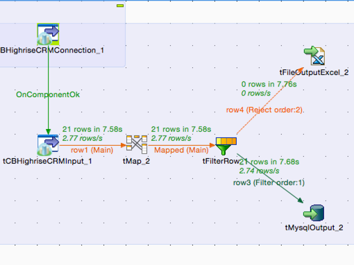

## tCBHighRiseConnection

### Overview
Connects & auhenticates to HighRise API.
Works with tCBHighRiseInput & tCBHighRiseOutput components
 
<h3>&nbsp;&nbsp;&nbsp;&nbsp;<a href="http://cloudbee.com/highrise-talend-component/?utm_source=talendexchange&utm_medium=listing&utm_content=highrise&utm_campaign=highrise_comp_talendexchangelisting">Plans & Pricing >></a></h3>
 
 
 

### Details
 
<h3>&nbsp;&nbsp;&nbsp;&nbsp;<a href="http://cloudbee.com/highrise-talend-component/?utm_source=talendexchange&utm_medium=listing&utm_content=highrise&utm_campaign=highrise_comp_talendexchangelisting">Plans & Pricing >></a></h3>
 
 
### Images

### Install Instructions
Download component files from http://cloudbee.com Client Area and copy to Talend custom components folder
### Resources
 * <a href=http://cloudbee.com/highrise-talend-component/?utm_source=talendexchange&utm_medium=listing&utm_content=highrise&utm_campaign=highrise_comp_talendexchangelisting>Read More >></a>

#### Release Notes

##### 1.0 - 2015-04-12 12:04:30

### Compatible
 -  5.4 (obsolete)
 -   5.5 (obsolete)
 -   5.6 (obsolete)
 -   6.0 (obsolete)
 -   6.1 (obsolete)
 -   6.2 (obsolete)