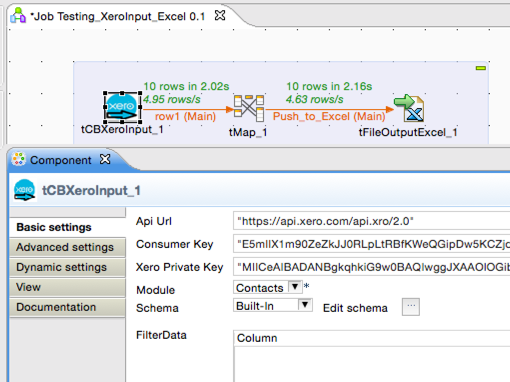
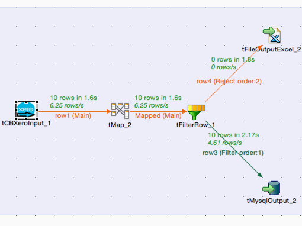

## tCBXeroInput

### Overview
This Xero Input component pulls data from Xero bookkeeping cloud service.
You can export data from many Xero modules (like Accounts, Contacts etc).
 
<h2>&nbsp;&nbsp;&nbsp;&nbsp;<a href="http://cloudbee.com/xero-talend-component/?utm_source=talendexchange&utm_medium=listing&utm_content=xero&utm_campaign=xero_comp_talendexchangelisting"><strong>Plans & Pricing >></strong></a></h2>
 
 
 

### Details
 
<h2>&nbsp;&nbsp;&nbsp;&nbsp;<a href="http://cloudbee.com/xero-talend-component/?utm_source=talendexchange&utm_medium=listing&utm_content=xero&utm_campaign=xero_comp_talendexchangelisting"><strong>Plans & Pricing >></strong></a></h2>
 
 
### Images

### Install Instructions
Download component files from http://cloudbee.com Client Area and copy to Talend custom components folder
### Resources
 * <a href=http://cloudbee.com/xero-talend-component/?utm_source=talendexchange&utm_medium=listing&utm_content=xero&utm_campaign=xero_comp_talendexchangelisting>Read More >></a>

#### Release Notes

##### 1.0 - 2015-04-16 10:18:48

### Compatible
 -  5.4 (obsolete)
 -   5.5 (obsolete)
 -   5.6 (obsolete)
 -   6.0 (obsolete)
 -   6.1 (obsolete)
 -   6.2 (obsolete)