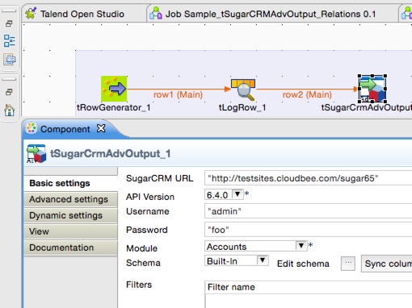

## tSugarCRMAdvOutput

### Overview
<h4>SugarCRM output component with advanced features</h4> 
Creates new items and updates existing data in SugarCRM v6.x.x site
<h3>&nbsp;&nbsp;&nbsp;&nbsp;<a href="http://cloudbee.com/sugar-crm-talend-component/?utm_source=talendexchange&utm_medium=listing&utm_content=sugarcrm&utm_campaign=sugarcrm_comp_talendexchange_listing">Plans & Pricing >></a></h3>
<ul>
<li>Supports SugarCRM version 6.x.x</li>
<li>Create relationships</li>
<li>Custom fields</li>
<li>Custom modules</li>
<li>Get response from API. Example ID of just created item</li>
 
</ul>
If you are looking components for connecting to SugarCRM version 7.x.x, then search for our tCBSugarCRMInput & tCBSugarCRMOutput components.
### Details

<h3>Supported modules</h3>
<ul>
<li>Custom Modules!!</li>
<li>Accounts</li>
<li>Bugs</li>
<li>Campaigns</li>
<li>Calendar</li>
<li>Calls</li>
<li>Campaigns</li>
<li>Cases</li>
<li>Connectors</li>
<li>Contacts</li>
<li>Currencies</li>
<li>Custom Fields</li>
<li>EmailMarketing</li>
<li>Meetings</li>
<li>Opportunities</li>
<li>Projects</li>
<li>Quotes</li>
<li>Product Catalog</li>
<li>Projects</li>
<li>Targets</li>
<li>Tasks</li>
<li>Schedulers</li>
<li>Quotes</li>
<li>Product Catalog</li>
</ul>

<h3>&nbsp;&nbsp;&nbsp;&nbsp;<a href="http://cloudbee.com/sugar-crm-talend-component/?utm_source=talendexchange&utm_medium=listing&utm_content=sugarcrm&utm_campaign=sugarcrm_comp_talendexchange_listing">Plans & Pricing >></a></h3>
 

 
 
### Images

### Resources
 * <a href=http://cloudbee.com/sugar-crm-talend-component/?utm_source=talendexchange&utm_medium=listing&utm_content=sugarcrm&utm_campaign=sugarcrm_comp_talendexchange_listing>Read More >></a>

#### Release Notes

##### 1.1 - 2013-08-01 07:53:55
 
- Connects to SugarCRM version 5.x.x - 6.x.x
- Create Relationships 

If you are looking components for connecting to SugarCRM version 7.x.x, then search for our tCBSugarCRMInput component.
### Compatible
 -  3.2 (obsolete)
 -   4.0 (obsolete)
 -   4.1 (obsolete)
 -   4.2 (obsolete)
 -   5.0 (obsolete)
 -   5.1 (obsolete)
 -   5.2 (obsolete)
 -   5.3 (obsolete)