# Cloudbee
  Cloudbee is the biggest Talend components provider (except Talend itself)
     <http://cloudbee.com>
  <nospam+peeter@cloudbee.com>

## <a href='./components/tCBActiveCampaignInput/readme.md'> tCBActiveCampaignInput</a>
 :warning: Compatibility not known

This ActiveCampaign Input component pulls data Activecampaign e-marketing cloud service.
You can export data from many ActiveCampaign modules (like Customers, Contacts etc).

<h2>&nbsp;&nbsp;&nbsp;&nbsp;<a href="http://cloudbee.com/activecampaign-talend-component/?utm_source=talendexchange&utm_medium=listing&utm_content=activecampaign&utm_campaign=activecampaign_comp_talendexchangelisting"><strong>Plans & Pricing >></strong></a></h2>
 
 
 

## <a href='./components/tCBActiveCampaignOutput/readme.md'> tCBActiveCampaignOutput</a>
 :warning: Compatibility not known

This ActiveCampaign Output component creates new items and updates existing data in Activecampaign e-marketing cloud service.
You can import data to many ActiveCampaign modules (like Customers, Contacts etc).

<h2>&nbsp;&nbsp;&nbsp;&nbsp;<a href="http://cloudbee.com/activecampaign-talend-component/?utm_source=talendexchange&utm_medium=listing&utm_content=activecampaign&utm_campaign=activecampaign_comp_talendexchangelisting"><strong>Plans & Pricing >></strong></a></h2>
 
 
 
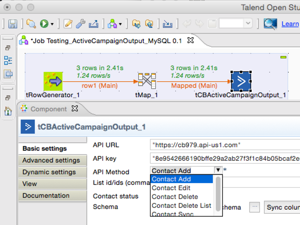

## <a href='./components/tCBBigCommerceInput/readme.md'> tCBBigCommerceInput</a>
 :warning: Compatibility not known

This BigCommerce Input component pulls data from BigCommerce e-shop.
You can export data from many BigCommerce modules (like Customers, Contacts etc).
 
<h2>&nbsp;&nbsp;&nbsp;&nbsp;<a href="http://cloudbee.com/big-commerce-talend-component/?utm_source=talendexchange&utm_medium=listing&utm_content=bigcommerce&utm_campaign=bigcommerce_comp_talendexchangelisting"><strong>Plans & Pricing >></strong></a></h2>
 
 
 

## <a href='./components/tCBBigCommerceOutput/readme.md'> tCBBigCommerceOutput</a>
 :warning: Compatibility not known

This BigCommerce Output component creates new items and updates existing data in BigCommerce e-commerce cloud service.
You can import data to many BigCommerce modules (like Customers, Contacts etc).
 
<h2>&nbsp;&nbsp;&nbsp;&nbsp;<a href="http://cloudbee.com/big-commerce-talend-component/?utm_source=talendexchange&utm_medium=listing&utm_content=bigcommerce&utm_campaign=bigcommerce_comp_talendexchangelisting"><strong>Plans & Pricing >></strong></a></h2>
 
 
 

## <a href='./components/tCBBrainTreeInput/readme.md'> tCBBrainTreeInput</a>
 :warning: Compatibility not known

This BrainTree Input component pulls data from BrainTree payment gateway
You can export data from many BrainTree modules (like Customers, Transactions etc).
 
<h2>&nbsp;&nbsp;&nbsp;&nbsp;<a href="http://cloudbee.com/braintree-talend-component/?utm_source=talendexchange&utm_medium=listing&utm_content=braintree&utm_campaign=braintree_comp_talendexchangelisting"><strong>Plans & Pricing >></strong></a></h2>
 
 
 

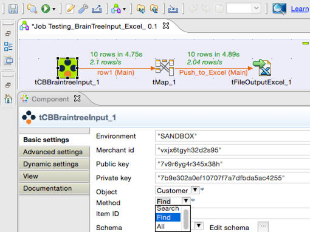

## <a href='./components/tCBBrainTreeOutput/readme.md'> tCBBrainTreeOutput</a>
 :warning: Compatibility not known

This ActiveCampaign Output component creates new items and updates existing data in Activecampaign e-marketing cloud service.
You can import data to many BrainTree modules (like Customers, Transactions etc).

<h2>&nbsp;&nbsp;&nbsp;&nbsp;<a href="http://cloudbee.com/braintree-talend-component/?utm_source=talendexchange&utm_medium=listing&utm_content=braintree&utm_campaign=braintree_comp_talendexchangelisting"><strong>Plans & Pricing >></strong></a></h2>
 
 
 

## <a href='./components/tCBDeskInput/readme.md'> tCBDeskInput</a>
 :warning: Compatibility not known

This Desk Input component pulls data Desk Support cloud service.
You can export data from many ActiveCampaign modules (like Customers, Companies etc).

<h2>&nbsp;&nbsp;&nbsp;&nbsp;<a href="http://cloudbee.com/desk-talend-component/?utm_source=talendexchange&utm_medium=listing&utm_content=desk&utm_campaign=desk_comp_talendexchangelisting"><strong>Plans & Pricing >></strong></a></h2>
 
 
 

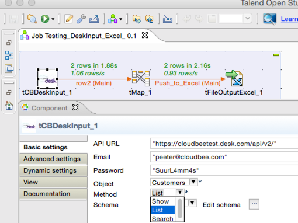

## <a href='./components/tCBDeskOutput/readme.md'> tCBDeskOutput</a>
 :warning: Compatibility not known

This Desk cloud service Output component creates new items and updates existing data in Desk Support cloud service
You can import data to many Desk modules (like Customers, Companies etc).

<h2>&nbsp;&nbsp;&nbsp;&nbsp;<a href="http://cloudbee.com/desk-talend-component/?utm_source=talendexchange&utm_medium=listing&utm_content=desk&utm_campaign=desk_comp_talendexchangelisting"><strong>Plans & Pricing >></strong></a></h2>
 
 
 

## <a href='./components/tCBErplyInput/readme.md'> tCBErplyInput</a>
 :warning: Compatibility not known

<h4>Erply components with advanced features</h4>
 
<h3>&nbsp;&nbsp;&nbsp;&nbsp;<a href="http://cloudbee.com/erply-talend-component/?utm_source=talendexchange&utm_medium=listing&utm_content=erply&utm_campaign=erply_comp_talendexchangelisting">Plans & Pricing >></a></h3>

<h5>Features</h5>
<ul>
<li>Filter by values</li>
<li>Sort by values</li>
<li>Pagination</li>
 
</ul>
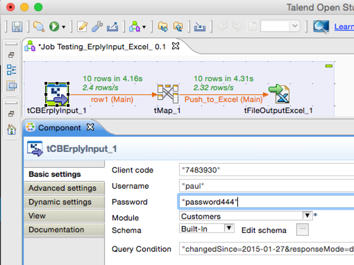

## <a href='./components/tCBErplyOutput/readme.md'> tCBErplyOutput</a>
 :warning: Compatibility not known

<h4>Erply components with advanced features</h4>
 
<h3>&nbsp;&nbsp;&nbsp;&nbsp;<a href="http://cloudbee.com/erply-talend-component/?utm_source=talendexchange&utm_medium=listing&utm_content=erply&utm_campaign=erply_comp_talendexchangelisting">Plans & Pricing >></a></h3>

<h5>Features</h5>
<ul>
<li>Filter by values</li>
<li>Sort by values</li>
<li>Pagination</li>
 
</ul>

## <a href='./components/tCBFreshBooksInput/readme.md'> tCBFreshBooksInput</a>
 :warning: Compatibility not known

This FreshBooks Input component pulls data FreshBooks Invoicing & Bookkeeping cloud service.
You can export data from many FreshBooks modules (like Client, Payments etc).
 
<h2>&nbsp;&nbsp;&nbsp;&nbsp;<a href="http://cloudbee.com/freshbooks-talend-component/?utm_source=talendexchange&utm_medium=listing&utm_content=freshbooks&utm_campaign=freshbooks_comp_talendexchangelisting"><strong>Plans & Pricing >></strong></a></h2>
 
 
 

## <a href='./components/tCBFreshBooksOutput/readme.md'> tCBFreshBooksOutput</a>
 :warning: Compatibility not known

This Freshbooks Output component creates new items and updates existing data in FreshBooks Invoicing & Bookkeeping cloud service.
You can import data to many FreshBooks modules (like Client, Payments etc).
 
<h2>&nbsp;&nbsp;&nbsp;&nbsp;<a href="http://cloudbee.com/freshbooks-talend-component/?utm_source=talendexchange&utm_medium=listing&utm_content=freshbooks&utm_campaign=freshbooks_comp_talendexchangelisting"><strong>Plans & Pricing >></strong></a></h2>
 
 
 

## <a href='./components/tCBHighRiseConnection/readme.md'> tCBHighRiseConnection</a>
 :warning: Compatibility not known

Connects & auhenticates to HighRise API.
Works with tCBHighRiseInput & tCBHighRiseOutput components
 
<h3>&nbsp;&nbsp;&nbsp;&nbsp;<a href="http://cloudbee.com/highrise-talend-component/?utm_source=talendexchange&utm_medium=listing&utm_content=highrise&utm_campaign=highrise_comp_talendexchangelisting">Plans & Pricing >></a></h3>
 
 
 

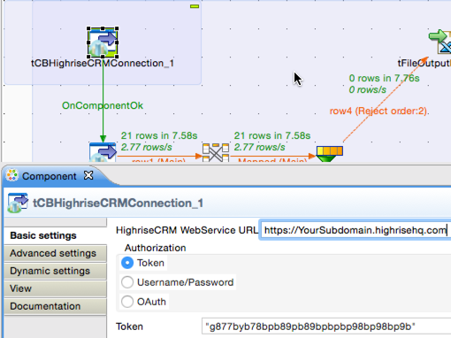

## <a href='./components/tCBHighRiseInput/readme.md'> tCBHighRiseInput</a>
 :warning: Compatibility not known

This HighRise Input component pulls data from HighRise CRM cloud service.
You can export data from many HighRise CRM modules (like Companies, People etc).
 
<h2>&nbsp;&nbsp;&nbsp;&nbsp;<a href="http://cloudbee.com/highrise-talend-component/?utm_source=talendexchange&utm_medium=listing&utm_content=highrise&utm_campaign=highrise_comp_talendexchangelisting"><strong>Plans & Pricing >></strong></a></h2>
 
 
 

## <a href='./components/tCBHighRiseOutput/readme.md'> tCBHighRiseOutput</a>
 :warning: Compatibility not known

This HighRise Output component creates new items and updates existing data in HighRise CRM cloud service.
You can import data to many HighRise modules (like Companies, People etc).
 
<h2>&nbsp;&nbsp;&nbsp;&nbsp;<a href="http://cloudbee.com/highrise-talend-component/?utm_source=talendexchange&utm_medium=listing&utm_content=highrise&utm_campaign=highrise_comp_talendexchangelisting"><strong>Plans & Pricing >></strong></a></h2>
 
 
 
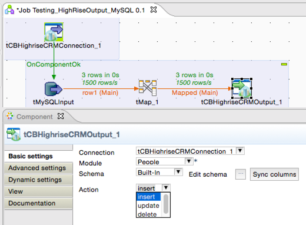

## <a href='./components/tCBIntuitQuickBooksConnection/readme.md'> tCBIntuitQuickBooksConnection</a>
 :warning: Compatibility not known

Connects & auhenticates to Intuit QuickBooks Online API.
Works with tCBIntuitQuickBooksInput & tCBIntuitQuickBooksOutput.
 
<h2>&nbsp;&nbsp;&nbsp;&nbsp;<a href="http://cloudbee.com/quickbooks-talend-component/?utm_source=talendexchange&utm_medium=listing&utm_content=intuitquickbooks&utm_campaign=intuitquickbooks_comp_talendexchangelisting"><strong>Plans & Pricing >></strong></a></h2>
 
 
 

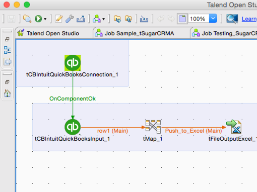

## <a href='./components/tCBIntuitQuickBooksInput/readme.md'> tCBIntuitQuickBooksInput</a>
 :warning: Compatibility not known

This component pulls data from Intuit QuickBooks Online BookKeeping cloud service.
You can export data from many Intuit QuickBooks Online modules (like Customers, Contacts etc).
 
<h2>&nbsp;&nbsp;&nbsp;&nbsp;<a href="http://cloudbee.com/quickbooks-talend-component/?utm_source=talendexchange&utm_medium=listing&utm_content=intuitquickbooks&utm_campaign=intuitquickbooks_comp_talendexchangelisting"><strong>Plans & Pricing >></strong></a></h2>
 
 
 

## <a href='./components/tCBIntuitQuickBooksOutput/readme.md'> tCBIntuitQuickBooksOutput</a>
 :warning: Compatibility not known

Creates new items and updates existing data in Intuit QuickBooks Online Bookkeeping cloud service
You can import data to many Intuit QuickBooks Online modules (like Customers, Contacts etc).
 
<h2>&nbsp;&nbsp;&nbsp;&nbsp;<a href="http://cloudbee.com/quickbooks-talend-component/?utm_source=talendexchange&utm_medium=listing&utm_content=intuitquickbooks&utm_campaign=intuitquickbooks_comp_talendexchangelisting"><strong>Plans & Pricing >></strong></a></h2>
 
 
 

## <a href='./components/tCBMagentoInput/readme.md'> tCBMagentoInput</a>
 :warning: Compatibility not known

<h4>Magento components with advanced features</h4>
Pulls data from Magento e-shop
<h3>&nbsp;&nbsp;&nbsp;&nbsp;<a href="http://cloudbee.com/magento-talend-component/?utm_source=talendexchange&utm_medium=listing&utm_content=magento&utm_campaign=magento_comp_talendexchangelisting">Plans & Pricing >></a></h3>
<h5>Supported Magento Flavors</h5>
<ul>
<li>Magento Community Edition (CE)</li>
<li>Magento Enterprise</li>
 
</ul>
<h5>Features</h5>
<ul>
<li>Custom fields</li>
<li>Custom modules</li>
<li>Filter by values</li>
<li>Sort by values</li>
<li>Count items</li>
<li>Get response from API. Example ID of just created item</li>
 
</ul>

## <a href='./components/tCBMagentoOutput/readme.md'> tCBMagentoOutput</a>
 :warning: Compatibility not known

<h4>Magento components with advanced features</h4>
<h3>&nbsp;&nbsp;&nbsp;&nbsp;<a href="http://cloudbee.com/magento-talend-component/?utm_source=talendexchange&utm_medium=listing&utm_content=magento&utm_campaign=magento_comp_talendexchangelisting">Plans & Pricing >></a></h3>
<h5>Supported Magento Flavors</h5>
<ul>
<li>Magento Community Edition (CE)</li>
<li>Magento Enterprise</li>
 
</ul>
<h5>Features</h5>
<ul>
<li>Custom fields</li>
<li>Custom modules</li>
<li>Filter by values</li>
<li>Sort by values</li>
<li>Count items</li>
<li>Get response from API. Example ID of just created item</li>
 
</ul>

## <a href='./components/tCBMailChimpOutput/readme.md'> tCBMailChimpOutput</a>
 :warning: Compatibility not known

Creates new items and updates existing data in MailChimp cloud service.
You can import data to Mailchimp. Good to use for creating & updating email subscriptions in Mailchimp.
 
<h2>&nbsp;&nbsp;&nbsp;&nbsp;<a href="http://cloudbee.com/mailchimp-talend-component/?utm_source=talendexchange&utm_medium=listing&utm_content=mailchimp&utm_campaign=mailchimp_comp_talendexchangelisting"><strong>Plans & Pricing >></strong></a></h2>
 
 
 
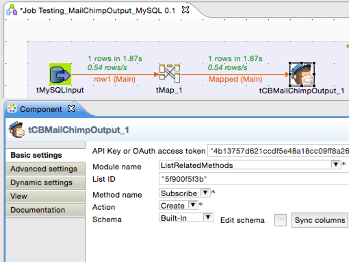

## <a href='./components/tCBPipeDriveInput/readme.md'> tCBPipeDriveInput</a>
 :warning: Compatibility not known

This Pipedrive Input component Pulls data from PipeDrive CRM cloud service.
You can export data from many PipeDrive modules (like Organizations, Deals etc).
 
<h2>&nbsp;&nbsp;&nbsp;&nbsp;<a href="http://cloudbee.com/pipedrive-talend-component/?utm_source=talendexchange&utm_medium=listing&utm_content=pipedrive&utm_campaign=pipedrive_comp_talendexchangelisting"><strong>Plans & Pricing >></strong></a></h2>
 
 
 

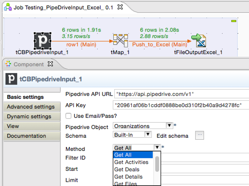

## <a href='./components/tCBPipeDriveOutput/readme.md'> tCBPipeDriveOutput</a>
 :warning: Compatibility not known

This PipeDrive Output component creates new items and updates existing data in PipeDrive CRM cloud service.
You can import data to many PipeDrive modules (like Organizations, Deals etc).
 
<h2>&nbsp;&nbsp;&nbsp;&nbsp;<a href="http://cloudbee.com/pipedrive-talend-component/?utm_source=talendexchange&utm_medium=listing&utm_content=pipedrive&utm_campaign=pipedrive_comp_talendexchangelisting"><strong>Plans & Pricing >></strong></a></h2>
 
 
 

## <a href='./components/tCBSaasuInput/readme.md'> tCBSaasuInput</a>
 :warning: Compatibility not known

This Saasu Input component Pulls data from Saasu bookkeeping cloud service.
You can export data from many Saasu modules (like Payments, Contacts etc).
 
<h2>&nbsp;&nbsp;&nbsp;&nbsp;<a href="http://cloudbee.com/saasu-talend-component/?utm_source=talendexchange&utm_medium=listing&utm_content=saasu&utm_campaign=saasu_comp_talendexchangelisting"><strong>Plans & Pricing >></strong></a></h2>
 
 
 

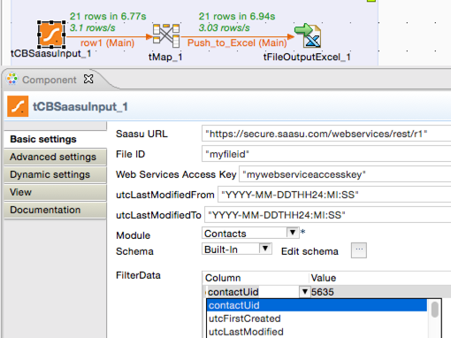

## <a href='./components/tCBSaasuOutput/readme.md'> tCBSaasuOutput</a>
 :warning: Compatibility not known

This Saasu Output component creates new items and updates existing data in Saasu bookkeeping cloud service
You can import data to many Saasu modules (like Payments, Contacts etc).
 
<h2>&nbsp;&nbsp;&nbsp;&nbsp;<a href="http://cloudbee.com/saasu-talend-component/?utm_source=talendexchange&utm_medium=listing&utm_content=saasu&utm_campaign=saasu_comp_talendexchangelisting"><strong>Plans & Pricing >></strong></a></h2>
 
 
 

## <a href='./components/tCBShopifyInput/readme.md'> tCBShopifyInput</a>
 :warning: Compatibility not known

This Shopify Input component pulls data from Shopify e-shop.
You can export data from many Shopify modules (like Customers, Products etc).
 
<h2>&nbsp;&nbsp;&nbsp;&nbsp;<a href="http://cloudbee.com/shopify-talend-component/?utm_source=talendexchange&utm_medium=listing&utm_content=shopify&utm_campaign=shopify_comp_talendexchangelisting"><strong>Plans & Pricing >></strong></a></h2>
 
 
 

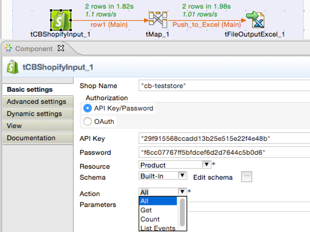

## <a href='./components/tCBShopifyOutput/readme.md'> tCBShopifyOutput</a>
 :warning: Compatibility not known

This Shopify Output component creates new items and updates existing data in Shopify e-shop.
You can import data to many Shopify modules (like Customers, Products etc).
 
<h2>&nbsp;&nbsp;&nbsp;&nbsp;<a href="http://cloudbee.com/shopify-talend-component/?utm_source=talendexchange&utm_medium=listing&utm_content=shopify&utm_campaign=shopify_comp_talendexchangelisting"><strong>Plans & Pricing >></strong></a></h2>
 
 
 

## <a href='./components/tCBSugarCRMConnection/readme.md'> tCBSugarCRMConnection</a>
 :warning: Compatibility not known

Connects & auhenticates to SugarCRM REST.
- Works with tCBSugarCRMInput & tCBSugarCRMOutput
- Supports latest SugarCRM versions - 7.x.x
- Debugging supported - optionally makes communication with API visible.
<h3>&nbsp;&nbsp;&nbsp;&nbsp;<a href="http://cloudbee.com/sugar-crm-talend-component/?utm_source=talendexchange&utm_medium=listing&utm_content=sugarcrm&utm_campaign=sugarcrm_comp_talendexchange_listing">Plans & Pricing >></a></h3>
 
 
 

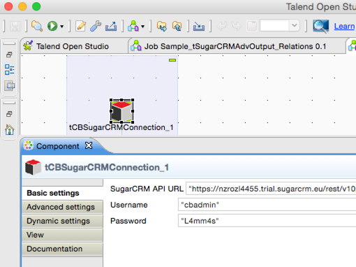

## <a href='./components/tCBSugarCRMInput/readme.md'> tCBSugarCRMInput</a>
 :warning: Compatibility not known

This SugarCRM Input component pulls data and relations from SugarCRM modules like Accounts, Contacts, Deals, Custom Modules etc. and pulls also relationships between items.
Supports latest SugarCRM versions 7.x.x
Works with tCBSugarCRMConnection component.

<h3>&nbsp;&nbsp;&nbsp;&nbsp;<a href="http://cloudbee.com/sugar-crm-talend-component/?utm_source=talendexchange&utm_medium=listing&utm_content=sugarcrm&utm_campaign=sugarcrm_comp_talendexchange_listing"><strong>Plans & Pricing >></strong></a></h3>

<h4>SugarCRM components with advanced features</h4> 
<ul>
<li>Retrieve relationships</li>
<li>Custom fields supported</li>
<li>Custom modules supported</li>
<li>Filter by values</li>
<li>Sort by values</li>
<li>Count items</li>
<li>Data pagination</li>
<li>Debug - make communication with API visible</li>
 
</ul>
If you are looking components for connecting to SugarCRM version 5.x.x - 6.x.x, then search for our tSugarCrmAdvInput & tSugarCrmAdvOutput components.
  
 
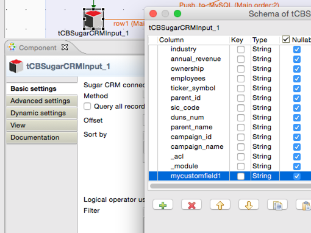

## <a href='./components/tCBSugarCRMOutput/readme.md'> tCBSugarCRMOutput</a>
 :warning: Compatibility not known

This SugarCRM Output component updates or inserts data into any SugarCRM modules, like Accounts, Contacts, Deals, Custom Modules etc. and creates relationships between items in different modules.
Supports latest SugarCRM versions 7.x.x
Works with tCBSugarCRMConnection component.
<h3>&nbsp;&nbsp;&nbsp;&nbsp;<a href="http://cloudbee.com/sugar-crm-talend-component/?utm_source=talendexchange&utm_medium=listing&utm_content=sugarcrm&utm_campaign=sugarcrm_comp_talendexchange_listing"><strong>Plans & Pricing >></strong></a></h3>

<h4>Advanced features</h4> 
<ul>
<li>Create relationships</li>
<li>Custom fields supported</li>
<li>Custom modules supported</li>
<li>Debug - make communication with API visible</li>
<li>Get response from API. Example - get back ID of just created item</li>
<li>Split responsed data flow - "Success" & "Rejected"</li>
<li>Get ID & error response from API about every rejected item</li>
 
</ul>
If you are looking components for connecting to SugarCRM version 5.x.x - 6.x.x, then search for our tSugarCrmAdvInput & tSugarCrmAdvOutput components.
 
 

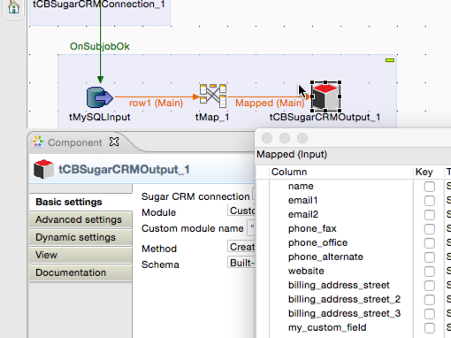

## <a href='./components/tCBTogglInput/readme.md'> tCBTogglInput</a>
 :warning: Compatibility not known

This Toggl Input component pulls data from Toggl time tracking cloud service.
You can export data from many Toggl modules (like Clients, Projects etc).
 
<h2>&nbsp;&nbsp;&nbsp;&nbsp;<a href="http://cloudbee.com/toggl-talend-component/?utm_source=talendexchange&utm_medium=listing&utm_content=toggl&utm_campaign=toggl_comp_talendexchangelisting"><strong>Plans & Pricing >></strong></a></h2>
 
 
 

## <a href='./components/tCBTogglOutput/readme.md'> tCBTogglOutput</a>
 :warning: Compatibility not known

This Toggl Output component creates new items and updates existing data in Toggl time tracking cloud service
You can import data to many Toggl modules (like Clients, Projects etc).
 
<h2>&nbsp;&nbsp;&nbsp;&nbsp;<a href="http://cloudbee.com/toggl-talend-component/?utm_source=talendexchange&utm_medium=listing&utm_content=toggl&utm_campaign=toggl_comp_talendexchangelisting"><strong>Plans & Pricing >></strong></a></h2>
 
 
 

## <a href='./components/tCBXeroInput/readme.md'> tCBXeroInput</a>
 :warning: Compatibility not known

This Xero Input component pulls data from Xero bookkeeping cloud service.
You can export data from many Xero modules (like Accounts, Contacts etc).
 
<h2>&nbsp;&nbsp;&nbsp;&nbsp;<a href="http://cloudbee.com/xero-talend-component/?utm_source=talendexchange&utm_medium=listing&utm_content=xero&utm_campaign=xero_comp_talendexchangelisting"><strong>Plans & Pricing >></strong></a></h2>
 
 
 

## <a href='./components/tCBXeroOutput/readme.md'> tCBXeroOutput</a>
 :warning: Compatibility not known

This Xero Output component creates new items and updates existing data in Xero bookkeeping cloud service.
You can import data to many Xero modules (like Accounts, Contacts etc).
 
<h2>&nbsp;&nbsp;&nbsp;&nbsp;<a href="http://cloudbee.com/xero-talend-component/?utm_source=talendexchange&utm_medium=listing&utm_content=xero&utm_campaign=xero_comp_talendexchangelisting"><strong>Plans & Pricing >></strong></a></h2>
 
 
 

## <a href='./components/tCBZohoCRMInput/readme.md'> tCBZohoCRMInput</a>
 :warning: Compatibility not known

This Zoho CRM Input component Pulls data from Zoho CRM cloud service.
You can export data from many Zoho CRM modules (like Accounts, Contacts etc).
 
<h2>&nbsp;&nbsp;&nbsp;&nbsp;<a href="http://cloudbee.com/zoho-crm-talend-component/?utm_source=talendexchange&utm_medium=listing&utm_content=zohocrm&utm_campaign=zohocrm_comp_talendexchangelisting"><strong>Plans & Pricing >></strong></a></h2>
 
 
 

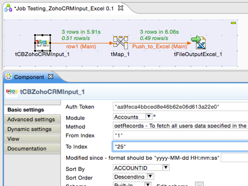

## <a href='./components/tCBZohoCRMOutput/readme.md'> tCBZohoCRMOutput</a>
 :warning: Compatibility not known

This ActiveCampaign Output component creates new items and updates existing data in Zoho CRM cloud service.
You can import data to many Zoho CRM modules (like Accounts, Contacts etc).
 
<h2>&nbsp;&nbsp;&nbsp;&nbsp;<a href="http://cloudbee.com/zoho-crm-talend-component/?utm_source=talendexchange&utm_medium=listing&utm_content=zohocrm&utm_campaign=zohocrm_comp_talendexchangelisting"><strong>Plans & Pricing >></strong></a></h2>
 
 
 

## <a href='./components/tSugarCRMAdvInput/readme.md'> tSugarCRMAdvInput</a>
 :warning: Compatibility not known

<h4>SugarCRM Input components with advanced features</h4> 
Pulls data from SugarCRM v6.x.x site
<h3>&nbsp;&nbsp;&nbsp;&nbsp;<a href="http://cloudbee.com/sugar-crm-talend-component/?utm_source=talendexchange&utm_medium=listing&utm_content=sugarcrm&utm_campaign=sugarcrm_comp_talendexchange_listing">Plans & Pricing >></a></h3>
<ul>
<li>Supports SugarCRM version 6.x.x</li>
<li>Pull relationships</li>
<li>Custom fields</li>
<li>Custom modules</li>
<li>Filter by values</li>
<li>Sort by values</li>
<li>Count items</li>
 
</ul>
If you are looking components for connecting to SugarCRM version 7.x.x, then search for our tCBSugarCRMInput & tCBSugarCRMOutput components.
 
 

## <a href='./components/tSugarCRMAdvOutput/readme.md'> tSugarCRMAdvOutput</a>
 :warning: Compatibility not known

<h4>SugarCRM output component with advanced features</h4> 
Creates new items and updates existing data in SugarCRM v6.x.x site
<h3>&nbsp;&nbsp;&nbsp;&nbsp;<a href="http://cloudbee.com/sugar-crm-talend-component/?utm_source=talendexchange&utm_medium=listing&utm_content=sugarcrm&utm_campaign=sugarcrm_comp_talendexchange_listing">Plans & Pricing >></a></h3>
<ul>
<li>Supports SugarCRM version 6.x.x</li>
<li>Create relationships</li>
<li>Custom fields</li>
<li>Custom modules</li>
<li>Get response from API. Example ID of just created item</li>
 
</ul>
If you are looking components for connecting to SugarCRM version 7.x.x, then search for our tCBSugarCRMInput & tCBSugarCRMOutput components.

