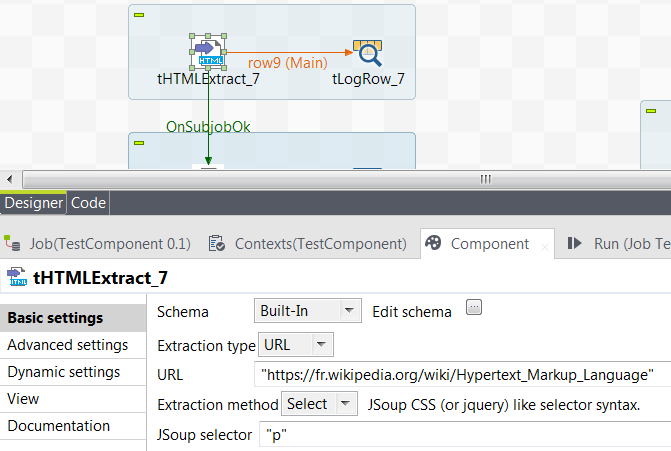

## tHTTPExtract

### Overview
Using various strategies to extract HTML data from an indicated file, URL or String
### Details
Using various strategies based on JSoup to extract HTML data from an indicated file, URL or String
### Images

### Install Instructions
Like usual.

#### Release Notes

##### 1.0 - 2017-07-24 13:32:49
Extract HTML data from an indicated file, URL or String
### Compatible
 -  5.0 (obsolete)
 -   5.1 (obsolete)
 -   5.2 (obsolete)
 -   5.3 (obsolete)
 -   5.4 (obsolete)
 -   5.5 (obsolete)
 -   5.6 (obsolete)
 -   6.0 (obsolete)
 -   6.1 (obsolete)
 -   6.2 (obsolete)
 -   6.3 (obsolete)