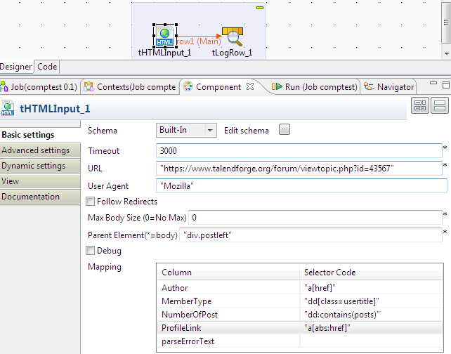

## tHTMLInput

### Overview
tHTMLInput component allows you to provide custom selector and get results in tabular format as per schema defined in component.

It iterates on Parent element which is provided on Parent Element text box and then try to get the information which is listed under the parent.

Features
Provides output in Tabular format.
You can customise selectors.
Element can be added, deleted, edited through UI table.
Text Extraction.
Element/Tag extraction.
Link Extraction.
### Details
Benefits:
Get Result in Tabular(Table) format. 
Full support to most of Jsoup selectors.

Features
Provides output in Tabular format.
You can customise selectors.
Element can be added, deleted, edited through UI table.
Text Extraction.
Element/Tag extraction.
Link Extraction.

### Images

### Install Instructions
Follow the usual instructions

#### Release Notes

##### 1.101 - 2015-04-22 16:47:30
tHTMLInput component parses an HTML document with help from jsoup Java library (jsoup.org).
You can configure ‘N’ number of elements from provided parent Element to extract from the document. It supports all the type of selectors, All text or Element  can be available through the jsoup class Elements, allowing you to use the power of jsoup to process, however, it’s simple to configure as mentioned on my post here. do this yourself using a component such.

##### 2 - 2015-07-20 07:39:27
tHTMLInput component parses an HTML document with help from jsoup Java library (jsoup.org).
You can configure ‘N’ number of elements from provided parent Element to extract from the document. It supports all the type of selectors, All text or Element  can be available through the jsoup class Elements, allowing you to use the power of jsoup to process, however, it’s simple to configure as mentioned on my post here. do this yourself using a component such.

### Compatible
 -  5.0 (obsolete)
 -   5.1 (obsolete)
 -   5.2 (obsolete)
 -   5.3 (obsolete)
 -   5.4 (obsolete)
 -   5.5 (obsolete)
 -   5.6 (obsolete)
 -   6.0 (obsolete)