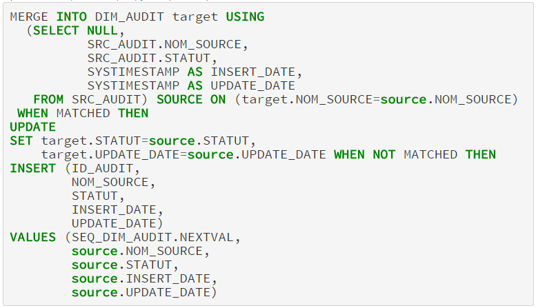
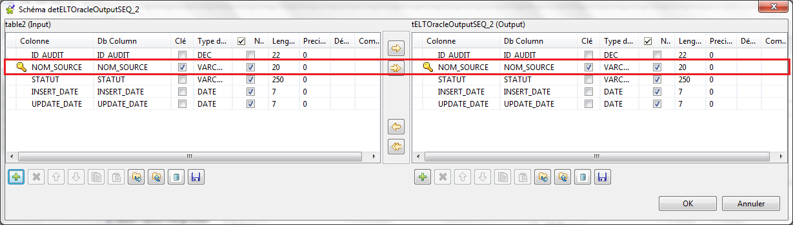
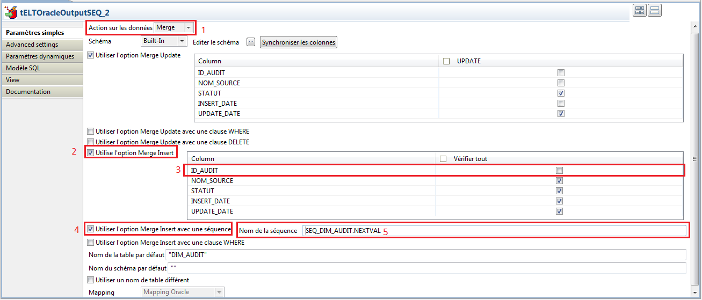

## tELTOracleOutputSEQ

### Overview
https://github.com/ejjamali/tELTOracleOutputSEQ
### Details
Le composant tELTOracleOutputSEQ est une évolution, du composant tELTOracleOutput de Talend, qui permet l'utilisation d'une séquence dans le cas du MERGE/INSERT.
### Images

### Install Instructions
Visiter le lien suivant :https://github.com/ejjamali/tELTOracleOutputSEQ

#### Release Notes

##### 1.0 - 2016-11-14 16:33:12
Le composant tELTOracleOutputSEQ est une évolution, du composant tELTOracleOutput de Talend, qui permet l'utilisation d'une séquence dans le cas du MERGE/INSERT.
### Compatible
 -  5.0 (obsolete)
 -   5.1 (obsolete)
 -   5.2 (obsolete)
 -   5.3 (obsolete)
 -   5.4 (obsolete)
 -   5.5 (obsolete)
 -   5.6 (obsolete)
 -   6.0 (obsolete)
 -   6.1 (obsolete)
 -   6.2 (obsolete)