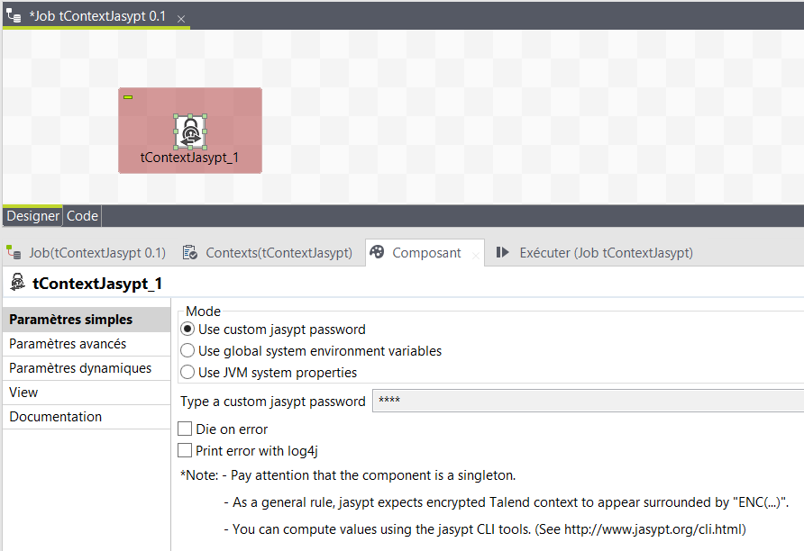

# Easy-BI
  Data/BI/Integration consultant
     <easy-bi.org>
  <nospam+jseb.minet@gmail.com>

## <a href='./components/tContextJasypt/readme.md'> tContextJasypt</a>
 :white_check_mark: Compatible with Talend 7.x / 8.x 

This component is working on PBE encryption method with jasypt.
Jasypt for “Java Simplified Encryption” is a library to encrypt (and decrypt) Talend context string based variables.
No specific knowlegde about encryption is needed, just define a system master password and you’re done.

