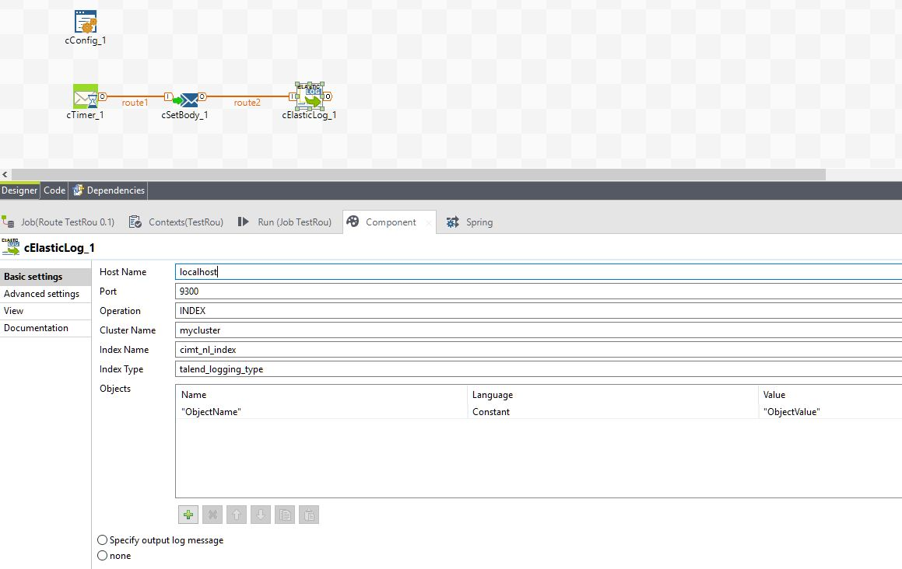

## ElasticLog

### Overview
A component which aggregates the logic creating a hashmap and sending it as an input to elasticsearch. 
### Details
It's a light weight component, and assists in achiving ELK framework, with more precision and no junk info. With different lanugages to support the extraction of data, the logic usually split in different components, is now done in a single component. 
### Images

### Install Instructions
The instructions could be found here. https://gitlab.com/hari.stpeters/talend-camel-elasticsearch/blob/master/README.md
The product source code can be found here. https://gitlab.com/hari.stpeters/talend-camel-elasticsearch

#### Release Notes

##### 6.3.1 - 2017-09-18 16:09:13
V0.1
Contains implementation of extracting information from exchange using default camel APIs, creating a map object and then passing it to elasticsearch. 
### Compatible
 -