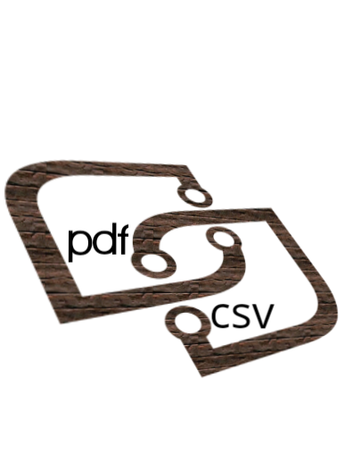
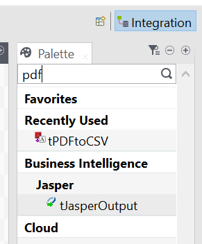
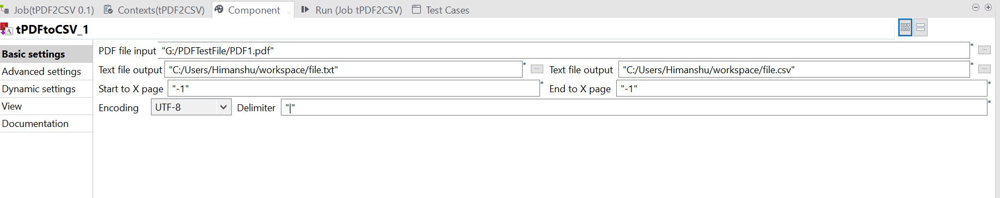

## tPDFtoCSV

### Overview
Use this component to convert pdf to csv and a text file to evaluate.

### Details
Use this component to extract data from a pdf file. The extracted data is in textual as well as a csv format.
This is an mvp, please contact for the full product. 
The full component is capable of extracting data from multiple/selected pages and also provides text enclosures. 
For Demo of the please email on royalhimansh87@gmail.com
### Images

#### Release Notes

##### 1.0 - 2020-01-19 20:38:34
Fixed the issue with label in .zip file
### Compatible
 - 6.5 (retired)
 -  7.0 (retired)
 -  7.1 (retired)