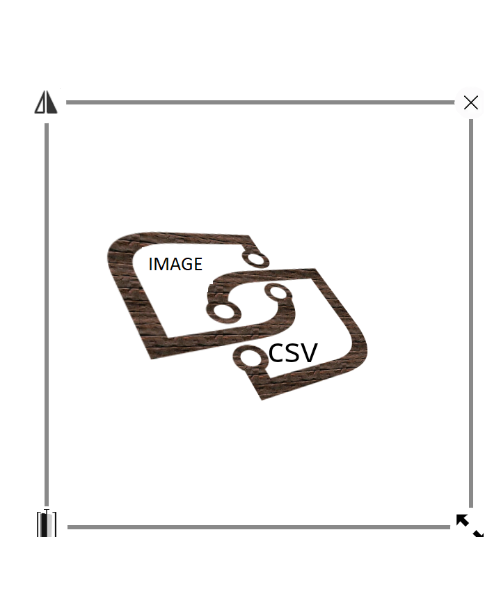
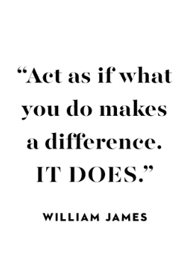

# Himanshu Sharma
  For Support contact - 9595352587
(Data Integration/ Data Stewardship/ Master Data Management/ Custom Connectors)
     <nospam+royalhimansh87@gmail.com>

## <a href='./components/tImage2CSV/readme.md'> tImage2CSV</a>
 :white_check_mark: Compatible with Talend 7.x / 8.x 

This component converts tabluar data in an image file to a csv file. It uses google trained data "tessdata"

