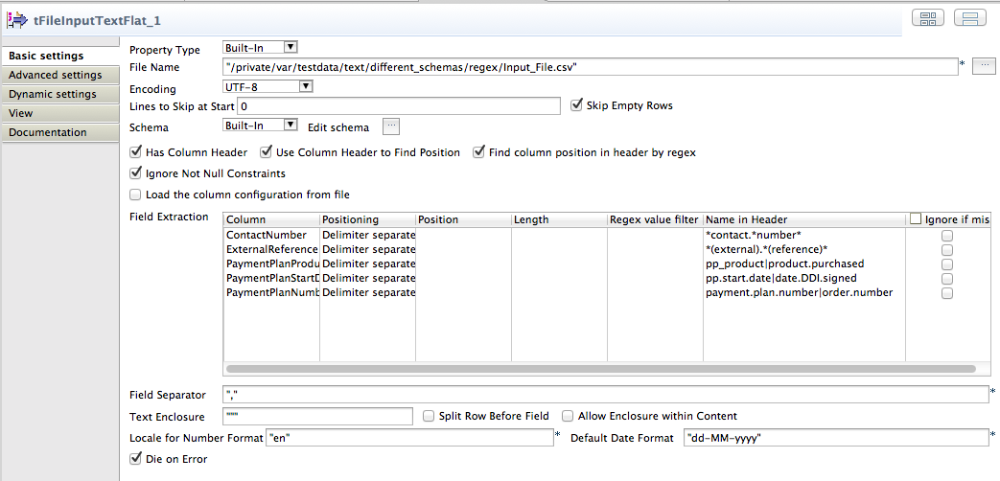

## tFileInputTextFlat

### Overview
This component is dedicated to read text files. 
The component allows to read text files with not stable structures and provide a feature similar to the dynamic schema but for the Open Studio edition.
The configuration can be read from an external file.
### Details
* reads fields with gaps between them
* can configure the columns by the header line (also with regex)
* reduced byte code foodprint
* can apply regex expressions to the field content
* translates the numbers for any country formats
* Can read the field extraction configuration from an external config file.
### Images

### Resources
 * <a href=http://jan-lolling.de/talend/components/help/tFileInputTextFlat.pdf>Documentation</a>
 * <a href=https://github.com/jlolling/talendcomp_tFileInputTextFlat>Source Code on Github</a>

#### Release Notes

##### 4.2 - 2016-06-11 13:01:44
* Bug fixed: In case of a enclosure char is used and not all fields and enclosed, sometimes the line break will not be detected
* Bug fixed: In case multiple enclosure in the content appears directly in line, the line will not correctly recognised
### Compatible
 -  5.4 (obsolete)
 -   5.5 (obsolete)
 -   5.6 (obsolete)
 -   6.0 (obsolete)
 -   6.1 (obsolete)
 -   6.2 (obsolete)
 -   6.3 (obsolete)
 -   6.4 (obsolete)
 -  6.5 (retired)
 -  7.0 (retired)
 -  7.1 (retired)