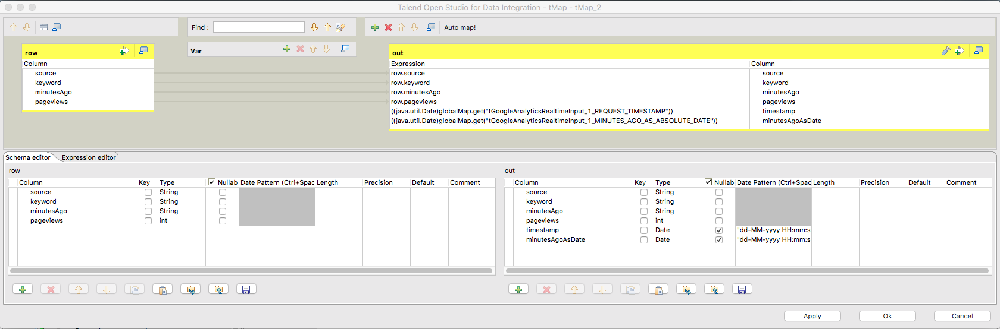
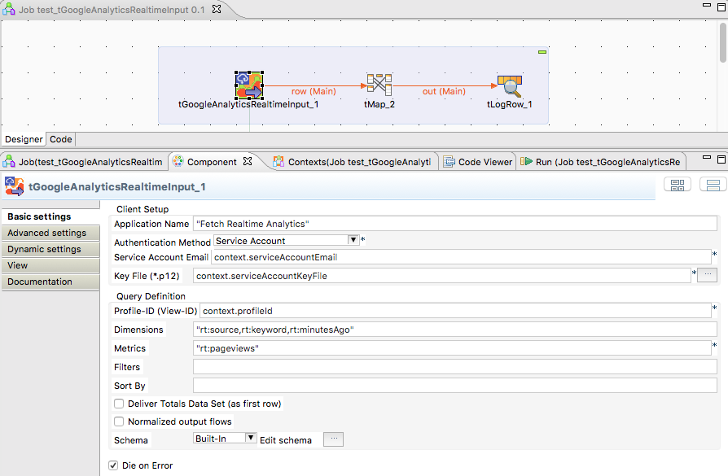
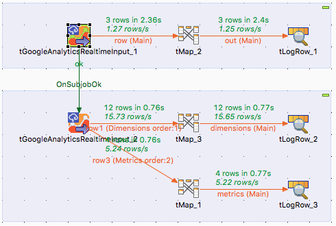

## tGoogleAnalyticsRealtimeInput

### Overview
This component use the Real Time API from Google Analytics. It can work with servioce accounts as well as with application-ID accounts.
It works in a similar way like the tGoogleAnalyticsInput but has limitation because of the limited functionality of the Real Time API.
There are different dimensions and metrics (e.g. with different name prefix).
### Details
* Convient way to get the real time report results
* Translates the dimension minutesAgo automatically into a Date without seconds
### Images

### Resources
 * <a href=http://jan-lolling.de/talend/howtos/google_service_account/create-a-google-service-account.html>How to create a Google service account</a>
 * <a href=https://sourceforge.net/projects/talend-user-components/>Source Code</a>

#### Release Notes

##### 2.0 - 2016-02-08 19:32:42
* First published version. Well tested with the great support of Hans Ressing.
### Compatible
 -  5.2 (obsolete)
 -   5.3 (obsolete)
 -   5.4 (obsolete)
 -   5.5 (obsolete)
 -   5.6 (obsolete)
 -   6.0 (obsolete)
 -   6.1 (obsolete)
 -   6.2 (obsolete)
 -   6.3 (obsolete)
 -   6.4 (obsolete)
 -  6.5 (retired)
 -  7.0 (retired)
 -  7.1 (retired)