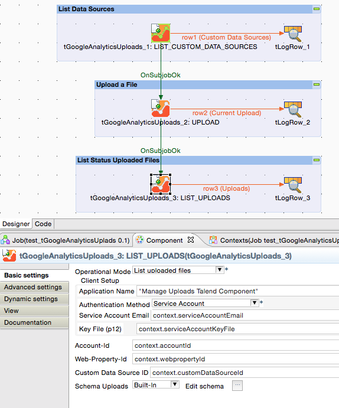
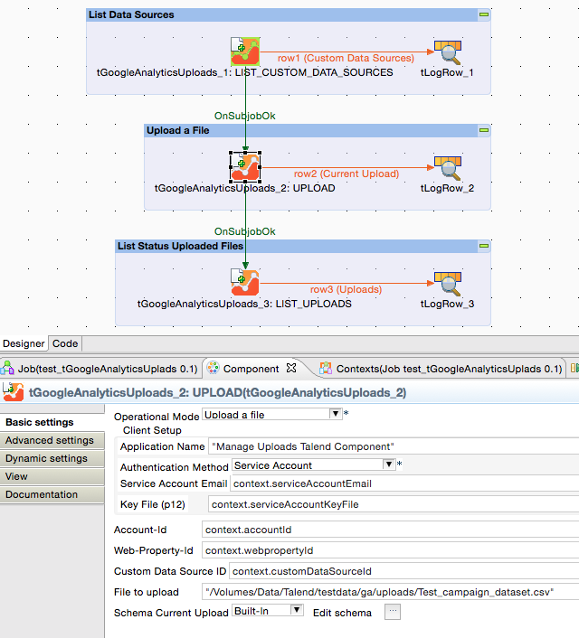
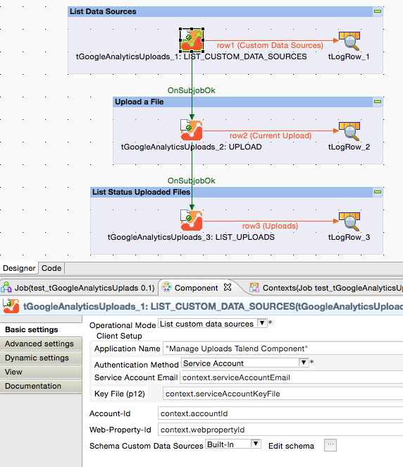

## tGoogleAnalyticsUploads

### Overview
Google Analytics provides the possibility to upload files into so called custom data sources. 
These custom data sources can be used to merge company key figures with Google Analytics key figures.
This component provides an easy way to upload files into custom data sources.
### Details
* List all custom data sources
* Upload a file into a custom data source
* List status of the uploaded files
* Can handle Service Accounts
* Tolerant error handling
### Images

### Resources
 * <a href=http://sourceforge.net/projects/talend-user-components/>Source Code</a>
 * <a href=http://jan-lolling.de/talend/howtos/google_service_account/create-a-google-service-account.html>How to create a Google service account</a>

#### Release Notes

##### 1.1 - 2015-12-18 18:04:40
* updated Google APIs used
### Compatible
 -  5.3 (obsolete)
 -   5.4 (obsolete)
 -   5.5 (obsolete)
 -   5.6 (obsolete)
 -   6.0 (obsolete)
 -   6.1 (obsolete)
 -   6.2 (obsolete)
 -   6.3 (obsolete)
 -   6.4 (obsolete)
 -  6.5 (retired)
 -  7.0 (retired)
 -  7.1 (retired)