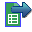
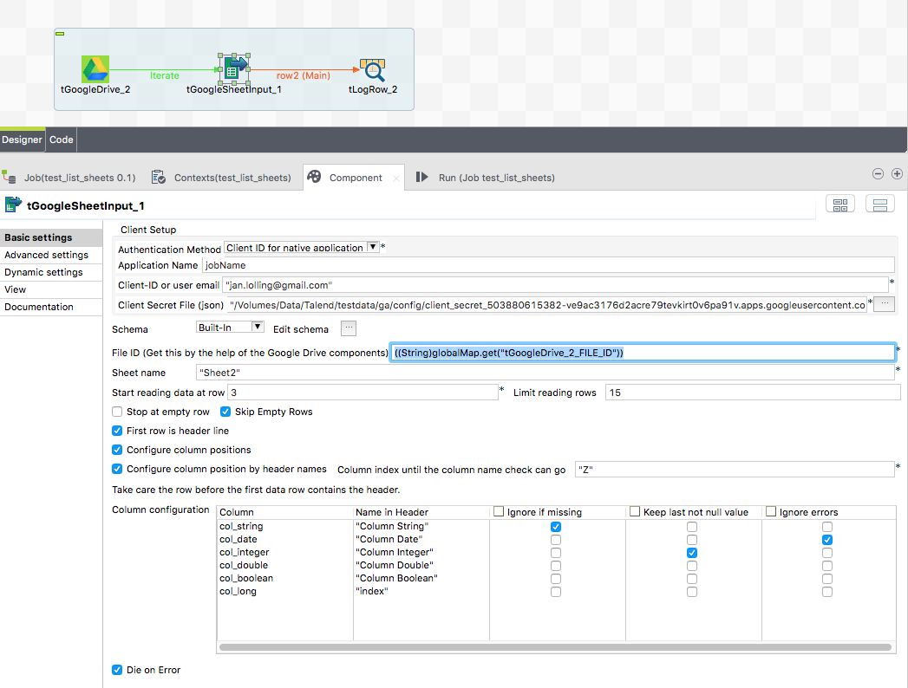

## tGoogleSheet components

### Overview
This component reads Google Sheets.
It supports service accounts as well as application-client-ID as authentication method (2-factor).
It has capabilities to configure the correct column position by the header line.
It can parse dates tolerant.
This component expects the Spreadsheet-ID. To get this use tGoogleDrive (from Talend Exchange) or the build-in tGoogleDriveList (with less funtionality)
### Details
* Configure columns by the header row
* Tolerant Date parser used
* Service account or Application-Client-ID usable as authentication method
### Images

### Resources
 * <a href=https://github.com/jlolling/talendcomp_tGoogleSheet/releases/download/1.0/tGoogleSheet.pdf>Documentation</a>
 * <a href=https://github.com/jlolling/talendcomp_tGoogleSheet>Source code</a>

#### Release Notes

##### 1.0 - 2017-02-26 19:59:03
* First tested version
### Compatible
 -  5.6 (obsolete)
 -   6.0 (obsolete)
 -   6.1 (obsolete)
 -   6.2 (obsolete)
 -   6.3 (obsolete)