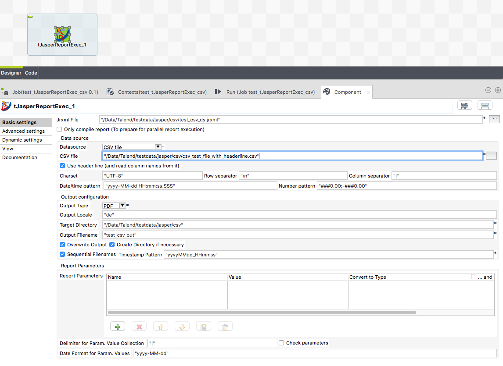

## tJasperReportExec

### Overview
This component can use a local jrxml file and compiles, fills and exports the report in a Talend job without a JasperServer.

It detect the need of compiling the report as well as subreports.

It uses the JasperLibrary 6.15.0 - used in the latest Jasper Studio 7

If you need Barcodes you have to add all necessary libraries with tLoadLibrary and it will work.
Please refer to the linked documentation to get more information about the necessary libraries and how to setup them.
Unlike the build in components tJasperOutput this component can use all typical data sources:
* JDBC connection (all possible database connections from Talend are enabled)
* XML files
* CSV files
* Dummy records for reports which gets its values from other sources e.g. in sub reports.

The component supports Jasper Report Books. A very nive design template to build highly complex reports.
You can set parameters and you can use resource bundles.
Please take care building a report with the correct compatibility settings inn Jaspersoft Studio. 
Please refer to the linked documentation how to do that. 
### Details
* Use JasperStudio to design your complex report file
* Run this report here in your Talend job just like you would do it in Jaspersoft Studio
* Use resource bundles
* Set report parameters gathered in your job
* Set various export options for PDF and Excel
* Can handle reports created as books
* Can use JDBC database connections, XML files or CSV files as data source.
### Images

### Resources
 * <a href=https://github.com/jlolling/talendcomp_tJasperReportExec>Source Code</a>
 * <a href=http://jan-lolling.de/talend/components/help/tJasperReportExec.pdf>Documentation</a>

#### Release Notes

##### 2.1 - 2015-09-10 09:40:28
* Uses the new JasperLibrary release 6.1.1
* Optional check the input parameters and shows differences
* Works with XML data sources also in sub reports 
  Please take care you follow this instructions for the report design: http://community.jaspersoft.com/wiki/use-subreport-report-which-connected-xml-datasource
##### 2.2 - 2015-11-17 20:11:24
* Release 6.2.0 of JasperLibrary in use
* Missing libraries added to support PowerPoint format
##### 2.3 - 2016-02-22 09:35:37
* Fixes the problem, the option "Create Dirs" does not work
### Compatible
 -  5.2 (obsolete)
 -   5.3 (obsolete)
 -   5.4 (obsolete)
 -   5.5 (obsolete)
 -   5.6 (obsolete)
 -   6.0 (obsolete)
 -   6.1 (obsolete)
 -   6.2 (obsolete)