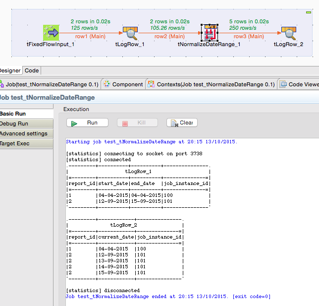
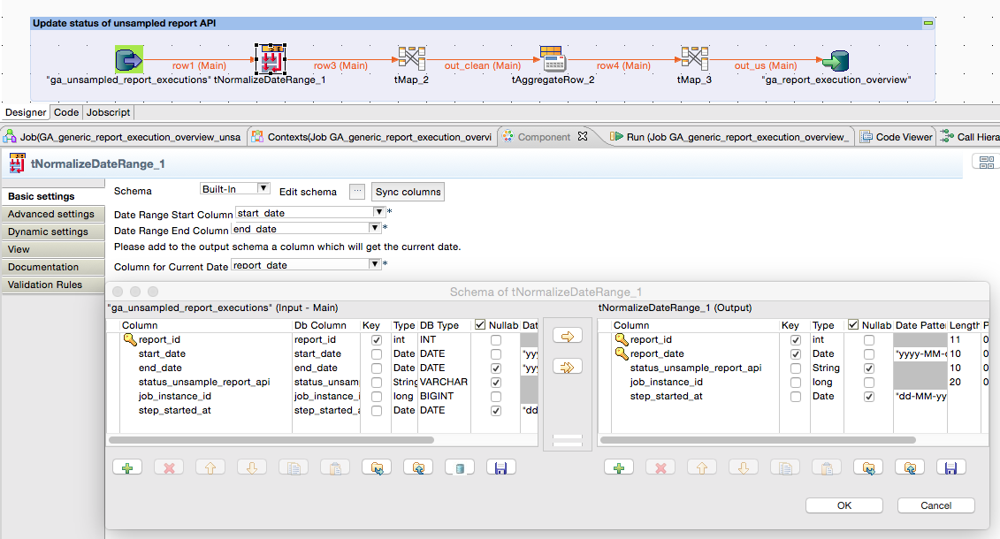

## tNormalizeDateRange

### Overview
Build multiple output records from an input record containing a date range.
This helps a lot in situation where a cross join with a calendar table is to expensive. 
### Details
* Normalizes records with a date range (start and end date) to multiple records with for every date inside the date range.
* Allows to transfer the columns needed in the output schema, it is not necessary to use the same columns for input and output
### Images

### Resources
 * <a href=http://sourceforge.net/p/talend-user-components/code/HEAD/tree/talendcomp_tNormalizeDateRange/>Source Code</a>

#### Release Notes

##### 1.1 - 2015-10-13 17:15:11
* well tested version running in productive projects
### Compatible
 -  5.4 (obsolete)
 -   5.5 (obsolete)
 -   5.6 (obsolete)
 -   6.0 (obsolete)
 -   6.1 (obsolete)
 -   6.2 (obsolete)
 -   6.3 (obsolete)
 -   6.4 (obsolete)
 -  6.5 (retired)
 -  7.0 (retired)
 -  7.1 (retired)