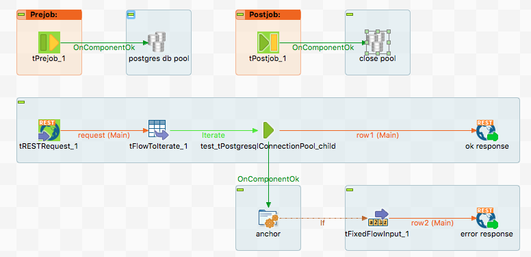

## tPostgresqlConnectionPool

### Overview
This is an implementation of the Apache DBCP2 pool project for PostgreSQL. It provides in a normal DI job the possibility to use a DataSource.
This is a great advantage for jobs which needs a database connection in a rapidely called embedded job. 
The pool has all the necessary features we expect today.

This version has additional features on board to cure the DataSource bug described in TDI-36765: https://jira.talendforge.org/browse/TDI-36765
The problem here is the wrong singleton character of the provided connections out of a DataSource. This can lead to serious damages in transactions.
Please read the last chapter of the component documentation how to establish the workaround.
### Details
* Can be used in normal DI jobs
* Can greatly improve the DataSource handling in DI jobs - also for DI made services
* Has a lot of features to take care of the health of the connections
* Can fix the actually wrong behavior of the Talend implementation to handout always the SAME connection instead of a new pooled connection.
* Provides a workaround for bug TDI-36765
### Images

### Resources
 * <a href=https://github.com/jlolling/talendcomp_tDatabaseConnectionPool>Source Code on Github</a>
 * <a href=http://jan-lolling.de/talend/components/help/tPostgresqlConnectionPool.pdf>Documentation</a>

#### Release Notes

##### 1.7 - 2016-07-03 19:01:22
* Improved configuration error handling 
* Provide workaround for the TDI-36765 bug - the wrong singleton nature of the connctions get from a data source.
##### 1.9 - 2016-11-26 20:19:57
* Updated PostgreSQL driver
* Improved error handling
* Bug fixed: if option Max pool size is switched off, there is now no pool size limit.
### Compatible
 -  5.6 (obsolete)
 -   6.0 (obsolete)
 -   6.1 (obsolete)
 -   6.2 (obsolete)