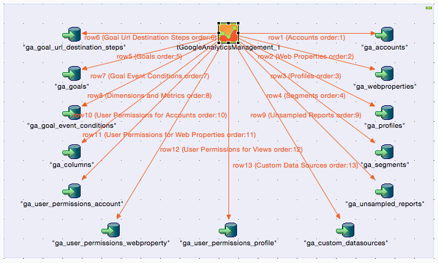
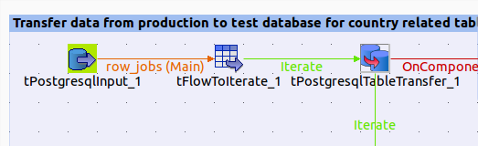
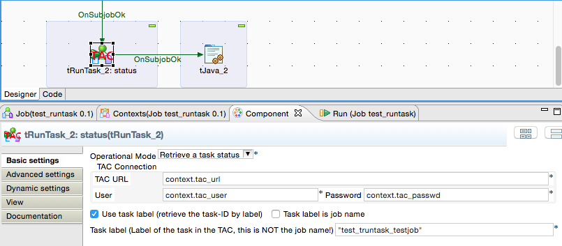
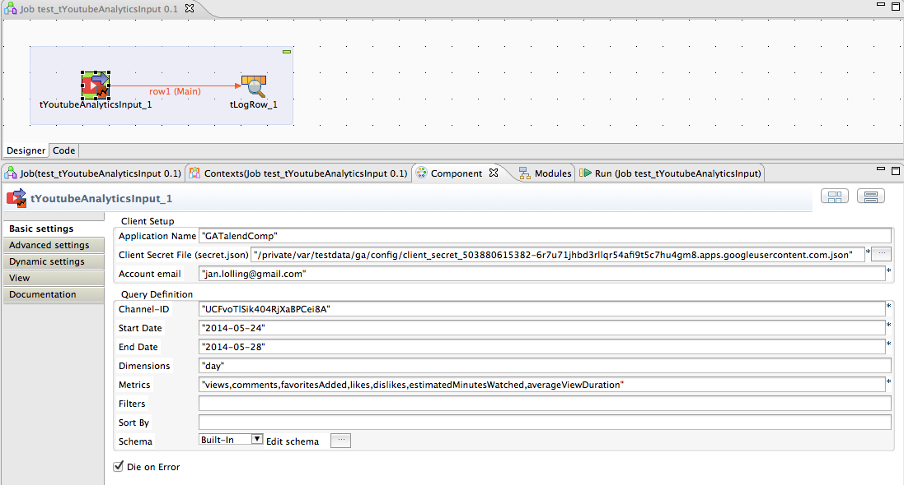

# Jan Lolling @ cimt AG
  Located in Berlin, Open Source addicted.
     <http://github.com/jlolling>
  <nospam+jan.lolling@gmail.com>

## <a href='./components/tEXATableTransfer/readme.md'> tEXATableTransfer</a>
 :white_check_mark: Compatible with Talend 7.x / 8.x 

This component is dedicated to transfer the table content from one database to an EXASolution database.
The component can truncate the target table before.
This component does not care about schema differences. 
All columns existing in source and target table will be transferred, all other ignored. The necessary schema will be created internally, therefore you have to provide only the source and target table name, thats it.
The component uses asynchronous transfer to half the duration because reading and writing can take place at the same time (or overlapping).

The component can also be used to export the data as CSV files dedicated to the bulk import.

You can configure columns as to be excluded from the transfer and as well
you can add aditional columns to the output.

The component can measure for a column the min/max values and return them as return values of this component. This helps to use it in a incremental load scenario.

## <a href='./components/tFileExcel-Components/readme.md'> tFileExcel-Components</a>
 :warning: Compatibility not known

The component suit constists of:
tFileExcelWorkbookOpen - Opens a workbook by reading a file or simply create an empty new one
    * detect automatically the file type - no need to declare it as setting
    * encrypt password secured files
tFileExcelWorkbookSave
    * write a workbook 
    * recalculate all formulas
    * encrypt the file with a password
    * automatically set the necessary file extension
tFileExcelSheetInput - read an Excel sheet with lots of comfort functions
    * Automatic adjustment of the columns to read
    * Read comments
    * Read cell style
    * Read and interpret date formats very tolerant
    * Read only the columns you need
    * Can skip erroneous cell content
tFileExcelSheetInputUnpivot
    * unpivots (or normalize) values from columns which are dynamically and not static
tFileExcelSheetOutput - write Excel sheets
    * write vertically (optional)
    * write only the columns you need
    * recalculate tables if they are affected (and update this way pivot tables)
    * recalculate conditional cell styles
    * apply cell styles from the first (or two) rows
    * apply cell data validation
    * write formulas
    * apply data validation to the new row (taken from the first written row)
    * shift existing row before writing the new row
tFileExcelSheetList
    * List all sheets
    * provide meta information about the sheets
tFileExcelNamedCellInput
    * read named cells
tFileExcelNamedCellOutput
    * write named cells
tFileExcelReferencedCellInput
    * read cells be absolut references
tFileExcelReferencedCellOutput
    * write into absolut referenced cells

## <a href='./components/tFileInputTextFlat/readme.md'> tFileInputTextFlat</a>
 :white_check_mark: Compatible with Talend 7.x / 8.x 

This component is dedicated to read text files. 
The component allows to read text files with not stable structures and provide a feature similar to the dynamic schema but for the Open Studio edition.
The configuration can be read from an external file.

## <a href='./components/tFTPClose/readme.md'> tFTPClose</a>
 :warning: Compatibility not known

Closes a FTP connection (also SFTP the other supported connection types).
Embedded jobs connection to a FTP/SFTP/FTPS Server without closing them can cause serious problems. 
This component is designed to detect the kind of connection beased on the settings of the tFTPConnection component and builds the necessary code to close it correctly.

## <a href='./components/tGoogleAdWordsReport/readme.md'> tGoogleAdWordsReport</a>
 :warning: Compatibility not known

This component handles Googles AdWords-API with the latest release v201809.
It authorise the user, executes the report and download the result as text file.
The query can be setup with the AdWords-Query-Language or with given report-type and fields.
To use this component please take care you understand the basics of the AdWordsReports. Refer to the Google description (linked here).
You need:
1. A developer token. You have to order this by Google
2. AdWords account
3. Client-Customer-ID
4. Technical credentials (Service Account or Client-ID for native applications)
The setup procedure in AdWords is not an easy task.
The component can download the report results in the formats CSV or XML. This formats can easily read by the Talend build-in components.
For CSV files the fields are exactly in the order or the AWQL or the give fields in the component.
The result can also send as flow into the job.

## <a href='./components/tGoogleAnalyticsInput/readme.md'> tGoogleAnalyticsInput</a>
 :warning: Compatibility not known

This component uses the Google's Core Report API (latest release 4).
You can use different ways to authorize the access:
    * Service Accounts for the enterprise users
    * Client-ID for native application for the semiprofessional usage
    * Can use the current v3 configuratio with v4 of the Analytics API without any changes. Necessary changes to the requests (e.g. the dimension ga:segment) will be added automatically internally. 
The component supports a normalised output to allow persisting the report data in a stable data model without always creating new tables for every new report.
In case of errors (which frequently occurse caused by heavy load on Google's servers) the component tries per default 5 times with an increasing wait time.

It is a good start to check the required query with the API explorer from Google: https://developers.google.com/apis-explorer/#p/

IMPORTANT:
Google has recently introduced a complete new system for Analytics called Google Analytics 4 (GA4). The current system supported by this component is now called Universal Analytics (UA).

## <a href='./components/tGoogleAnalyticsManagement/readme.md'> tGoogleAnalyticsManagement</a>
 :white_check_mark: Compatible with Talend 7.x / 8.x 

This component uses the Management API to collect all available items for your account like web property, profiles, segments and goals (also with URL destination steps and event conditions).
NEW: provides an output flow with describing information about all available dimensions and metrics (all columns).

NEW: Provides output flows for the user permissions to accounts, web properties and views.
The schemas has been changed (some additional columns added). 
Therefore please remove the component from your job and add it again. Unfortunately I do not know any other way to force the Studio to accept a new fixed defined schema.

## <a href='./components/tGoogleAnalyticsMCFInput/readme.md'> tGoogleAnalyticsMCFInput</a>
 :white_check_mark: Compatible with Talend 7.x / 8.x 

This component collects data from the Google Analytics Multi Channel Funnel API.
Please take a look at the documentation inside.
For questions and suggestions please please do not use the rating function. Instead contact me directly or use the Forum.

## <a href='./components/tGoogleAnalyticsRealtimeInput/readme.md'> tGoogleAnalyticsRealtimeInput</a>
 :white_check_mark: Compatible with Talend 7.x / 8.x 

This component use the Real Time API from Google Analytics. It can work with servioce accounts as well as with application-ID accounts.
It works in a similar way like the tGoogleAnalyticsInput but has limitation because of the limited functionality of the Real Time API.
There are different dimensions and metrics (e.g. with different name prefix).

## <a href='./components/tGoogleAnalyticsUnsampledReports/readme.md'> tGoogleAnalyticsUnsampledReports</a>
 :white_check_mark: Compatible with Talend 7.x / 8.x 

This component managed un-sampled reports for Google Analytics.
It can only be used with a Google Analytics Premium Account.
It is recommended to take care the reports needs to be treated this way because the quotas for un-sampled reports are much lower than for normal reports.
It is a good practice to run the report first as normal reports with tGoogleAnalyticsInput and check the sampling state and decide which reports needs to run as un-sampled reports.
Un-sampled reports are treated in an asynchronous process. Everything whats necessary to do the steps are build-in in this component, except the download of the files. Please us the new component tGoogleDrive to do this.

Please read the linked documentation. The procedure is a bit complex!

In case of questions feel free to contact me: jan.lolling@gmail.com

## <a href='./components/tGoogleAnalyticsUploads/readme.md'> tGoogleAnalyticsUploads</a>
 :white_check_mark: Compatible with Talend 7.x / 8.x 

Google Analytics provides the possibility to upload files into so called custom data sources. 
These custom data sources can be used to merge company key figures with Google Analytics key figures.
This component provides an easy way to upload files into custom data sources.

## <a href='./components/tGoogleDrive/readme.md'> tGoogleDrive</a>
 :warning: Compatibility not known

This component manages files and folders on a Google Drive via the Google Drive API v2.
It has various operational modes to:
- upload a file (also with set permissions to other users)
- download a file
- list files (with filtering)
- get the properties of a file/folder
- move files
- delete files

Especially for the usage in conjunction with tGoogleAnalyticsUnsampledReports this component provides the same authentication methods as for the Google Analytics and is able to work directly with file-Ids.
   
Please refer the linked documentation.
For questions and suggestions please contact me: jan.lolling@gmail.com
Please do not use the rating function to post questions.

## <a href='./components/tGoogleSheet components/readme.md'> tGoogleSheet components</a>
 :warning: Compatibility not known

This component reads Google Sheets.
It supports service accounts as well as application-client-ID as authentication method (2-factor).
It has capabilities to configure the correct column position by the header line.
It can parse dates tolerant.
This component expects the Spreadsheet-ID. To get this use tGoogleDrive (from Talend Exchange) or the build-in tGoogleDriveList (with less funtionality)

## <a href='./components/tJasperReportExec/readme.md'> tJasperReportExec</a>
 :warning: Compatibility not known

This component can use a local jrxml file and compiles, fills and exports the report in a Talend job without a JasperServer.

It detect the need of compiling the report as well as subreports.

It uses the JasperLibrary 6.15.0 - used in the latest Jasper Studio 7

If you need Barcodes you have to add all necessary libraries with tLoadLibrary and it will work.
Please refer to the linked documentation to get more information about the necessary libraries and how to setup them.
Unlike the build in components tJasperOutput this component can use all typical data sources:
* JDBC connection (all possible database connections from Talend are enabled)
* XML files
* CSV files
* Dummy records for reports which gets its values from other sources e.g. in sub reports.

The component supports Jasper Report Books. A very nive design template to build highly complex reports.
You can set parameters and you can use resource bundles.
Please take care building a report with the correct compatibility settings inn Jaspersoft Studio. 
Please refer to the linked documentation how to do that. 

## <a href='./components/tJasperServerReportStarter/readme.md'> tJasperServerReportStarter</a>
 :white_check_mark: Compatible with Talend 7.x / 8.x 

This component uses the scheduler web service of the JasperServer to start a report on the JasperServer. The report must be deployed already.
It is tested with the latest JasperServer releases.
You can set all possible parameters to the report and you can use all features of the scheduling service of the Jasper server.

## <a href='./components/tJobInstance_component_collection/readme.md'> tJobInstance_component_collection</a>
 :warning: Compatibility not known

These 4 components:
- tJobInstanceStart
- tJobInstanceEnd
- tJobDataRangeScanner
- tJobInstanceLiveCheck
are dedicated to manage job monitoring.
Helps you to have all essential information for every job run:
What has the job done, what comes in, what is the result...
Where, when, how how runs the jobs....
 
Please refer the linked documentation
The release 3.0 needs slightly changed tables!
Please contact me in case of questions and do not use the rating function to post questions.

## <a href='./components/tJSONDoc* components/readme.md'> tJSONDoc* components</a>
 :warning: Compatibility not known

This suite constists of 4 components:
tJSONDocOpen - the basis of all other components. It represents the JSON document it self, all other components are dedicated to work with this document
tJSONDocInput - read from an object or an array
tJSONDocInputStream - read very large json files as stream
tJSONDocOutput - create the sub elements of the JSON document and write the attributes of Objects or values of arrays.
tJSONDocSave - render and format the final document and provide the content to a flow or a file.

Then idea behind these components is to read or build your json document in multiple steps right where you need or fetch the necessary data.
The components can refer to eachother and use this way the current json node of the referenced component to dock on and start working here.

Many thanks to my customer GVL in Berlin (Martin, Karim and Ralf) for their great support by ideas and tests.

## <a href='./components/tMysqlConnectionPool/readme.md'> tMysqlConnectionPool</a>
 :white_check_mark: Compatible with Talend 7.x / 8.x 

This is an implementation of the Apache DBCP2 pool project for MySQL. It provides in a normal DI job the possibility to use a DataSource.
This is a great advantage for jobs which needs a database connection in a rapidely called embedded job. 
The pool has all the necessary features we expect today.

## <a href='./components/tMysqlTableTransfer/readme.md'> tMysqlTableTransfer</a>
 :white_check_mark: Compatible with Talend 7.x / 8.x 

This component is dedicated to transfer the table content from one database to another database.
The component can truncate the target table before or disable all constraints while importing the data.
This component does not care about schema differences. All columns existing in source and target table will be transferred, all other ignored. The necessary schema will be created internally, therefore you have to provide only the source and target table name, thats it.
The component uses asynchronous transfer to half the duration because reading and writing can take place at the same time (or overlapping).
The component provide an optional file output for MySQL bulk load.

## <a href='./components/tNormalizeDateRange/readme.md'> tNormalizeDateRange</a>
 :white_check_mark: Compatible with Talend 7.x / 8.x 

Build multiple output records from an input record containing a date range.
This helps a lot in situation where a cross join with a calendar table is to expensive. 

## <a href='./components/tOracleTableTransfer/readme.md'> tOracleTableTransfer</a>
 :white_check_mark: Compatible with Talend 7.x / 8.x 

This component is dedicated to transfer the table content from one database to another database.
The component can truncate the target table before.
This component does not care about schema differences. 
All columns existing in source and target table will be transferred, all other ignored. The necessary schema will be created internally, therefore you have to provide only the source and target table name, thats it.
The component uses asynchronous transfer to (up to) halve the duration because reading and writing can take place at the same time (or overlapping).

## <a href='./components/tPostgresqlConnectionPool/readme.md'> tPostgresqlConnectionPool</a>
 :warning: Compatibility not known

This is an implementation of the Apache DBCP2 pool project for PostgreSQL. It provides in a normal DI job the possibility to use a DataSource.
This is a great advantage for jobs which needs a database connection in a rapidely called embedded job. 
The pool has all the necessary features we expect today.

This version has additional features on board to cure the DataSource bug described in TDI-36765: https://jira.talendforge.org/browse/TDI-36765
The problem here is the wrong singleton character of the provided connections out of a DataSource. This can lead to serious damages in transactions.
Please read the last chapter of the component documentation how to establish the workaround.

## <a href='./components/tPostgresqlTableTransfer/readme.md'> tPostgresqlTableTransfer</a>
 :warning: Compatibility not known

This component is dedicated to transfer the table content from one database to another database.
The component can truncate the target table before.
This component does not care about schema differences. All columns existing in source and target table will be transferred, all other ignored. The necessary schema will be created internally, therefore you have to provide only the source and target table name, thats it.
The component uses asynchronous transfer to half the duration because reading and writing can take place at the same time (or overlapping).

The component can also be used to export the data as CSV files dedicated to the bulk import.

## <a href='./components/tRunTask/readme.md'> tRunTask</a>
 :white_check_mark: Compatible with Talend 7.x / 8.x 

This component can trigger or check task in the Talend Administration Center.
It helps to create sophisticated job chains because you can detect in the unlimited flexibility the necessary events or parameters to start a task in the TAC.
With the help of this component you can avoid deploying "monster" jobs containing all jobs needed in a complex task. You simply deploy all necessary jobs as tasks and starts them with a another job.
You can stop the "trigger" job and all currently running task will finishes they work without being interrupted.

Because of the check functionality you can create watchdog jobs for important tasks.

## <a href='./components/tYoutubeAnalyticsInput/readme.md'> tYoutubeAnalyticsInput</a>
 :warning: Compatibility not known

This component collect analytics data for YouTube.
It uses the latest Google API to collect the data.
The setup of the account and authorisation is not trivial. 
Please take a look at the documentation linked here.
Many thanks to Alvaro for sharing ideas and test support.

New API revision used
Documentation improved with more information how to configure and hints in case of problems.

Documentation: http://jan-lolling.de/talend/components/help/tYoutubeAnalyticsInput.pdf

