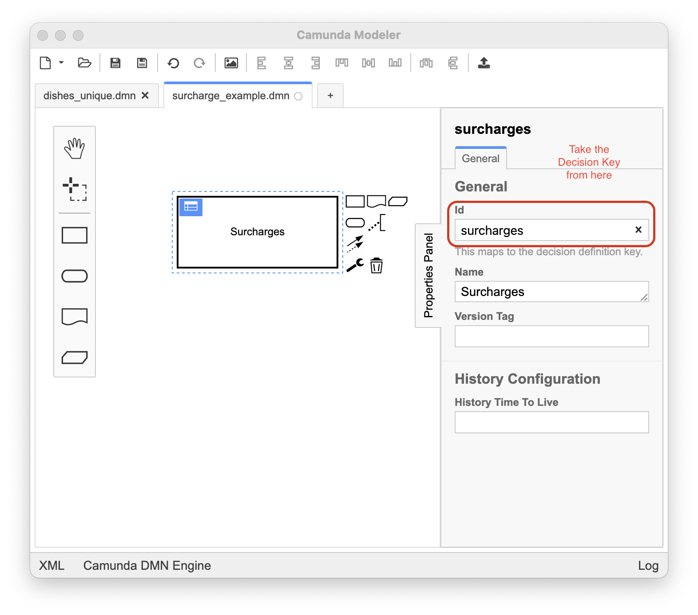
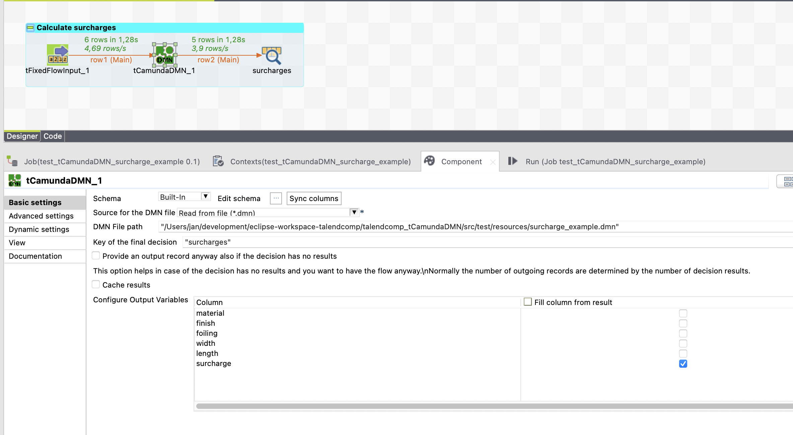
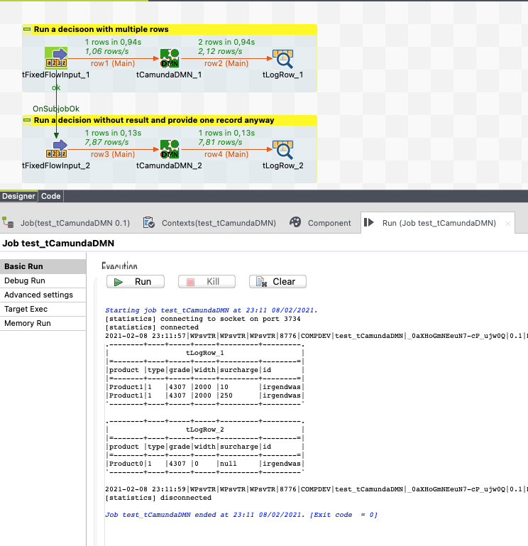

## tCamundaDMN

### Overview
Run DMN rules in your job with all the power of Camunda DMN. No server needed, the rules will be evaluated locally in your job.
Rules can be provided as dmn file in the file system or as resource in the classpath.

The component contains everything whats needed. No need for external severs or resources (of course the dmn file is needed).
### Details
Externalize business rules from your job
### Images

### Resources
 * <a href=https://github.com/xommaterials/talendcomp_tCamundaDMN/blob/master/doc/tug_dmn.pdf>Documentation</a>
 * <a href=https://github.com/xommaterials/talendcomp_tCamundaDMN>Source Code</a>

#### Release Notes

##### 1.4 - 2021-05-04 14:06:47
* Release in productive use
* Check of input and output consistency - decision variables must match to schema variables
* Multi-decision diagrams supported
### Compatible
 - 6.5 (retired)
 -  7.0 (retired)
 -  7.1 (retired)
 - 7.2
 - 7.3