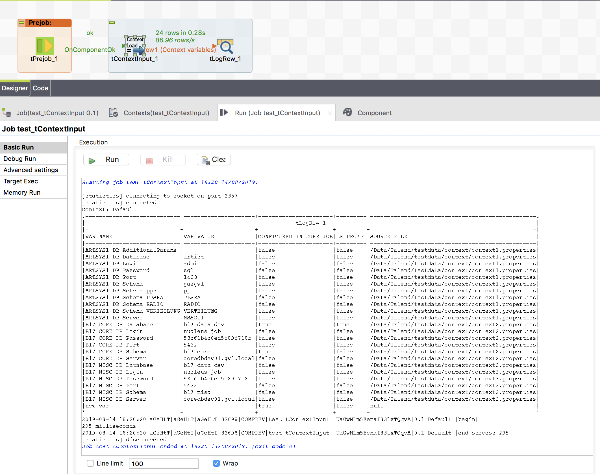

## tContexrInput

### Overview
Provide a flow containing all context variables of the current job.
Load context variables from various filtered files within multiple directories.
Load context variables from files or directories referenced from context variables
Prevent load context from loading if a parent job has already loaded the context.

In the setting: Context file filters and locations you can add simply directories oder direcxtories + file wildcard filters.
The component will walk through these entries and load the files.

You can also specify a key pattern for properties which points to other property files (or directories) and these files will be read right after reading the current file.

In the outgoing flow of the component you will get all context variables with:
* name
* value
* is the var configured in the current job
* is it a prompt variable
* from which property file was the value finally loaded

### Details
* Most flexible context load from files
* Read context variables from various files and know exactly from which
* prevent embedded jobs fromm context load if the parent job has already done this
* Can check if passwords are encrypted and decrypt them
### Images

### Resources
 * <a href=https://github.com/jlolling/talendcomp_tContextInput>Source Code</a>
 * <a href=https://github.com/jlolling/talendcomp_tContextInput/blob/master/doc/tContextInput.pdf>Documentation</a>

#### Release Notes

##### 1.1 - 2019-08-16 07:52:52
* First productive releasee
##### 1.2 - 2019-08-27 13:43:09
* Password type works now correctly
* Passwords will not be rendered in the outgoing flow
* null values in the filters will not cause a NullPointerException anymore
##### 1.3 - 2019-09-04 19:14:02
* Solves a compiler problem if the context var value contains double quotas.
##### 1.4 - 2019-09-25 09:20:01
* Important bug fix: Context variables handover to a child job was overwritten by default values.
##### 1.5 - 2019-09-30 16:05:35
* Bug fixed: empty keys in the context properties file causes NullPointerException 
* Bug fixed: empty context var values causes NullPointerException
##### 1.8 - 2020-01-16 10:30:18
* Prevent value conversions if not needed (improved stability)
* improved error handling 
##### 1.9 - 2020-03-20 17:50:40
* Logging improved
##### 2.1 - 2020-07-08 21:26:17
* Allows to replace placeholders in the values by value defined in the component in the advanced settings
* Get rid of the log4j v1 dependency to prevent problems with Talend 7.3+
##### 3.1 - 2021-01-25 20:18:47
* Labels in UI fixed
* Replacement values can be used also for filter filters
##### 5.0 - 2021-11-16 14:24:45
* Enables the usage of the Talend internal password decryption. This affects values starting with "enc:" (the new Talend way to encrypt passwords internally)
* Bug solved: The component holds the file handles for the context files.
### Compatible
 - 6.5 (retired)
 -  7.0 (retired)
 -  7.1 (retired)
 - 7.2
 - 7.3