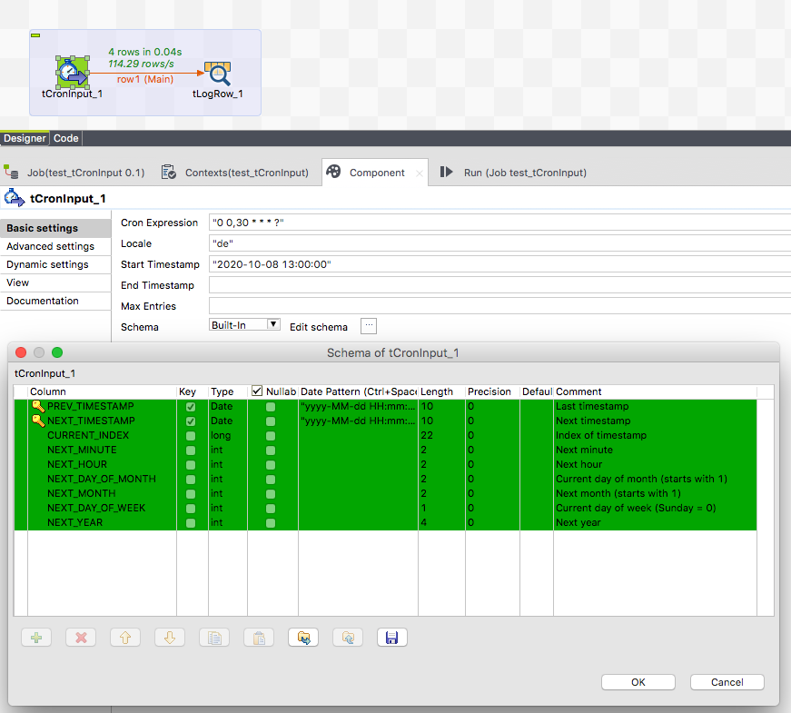

## tCronInput

### Overview
This component produces outgoing records with timestamps based on a cron expression.
The prev trigger event timestam and the next expected trigger timestamp will be delivered.
You can configure a start date and/or an end date as time range for which the cron expression will be evaluated.
### Details
* Produce records which can be used to check cron based events
* Setup optionally start and end date of the time range for which the records should be generated
### Images

### Resources
 * <a href=https://github.com/jlolling/talendcomp_tCronInput>Github source code</a>

#### Release Notes

##### 1.4 - 2020-10-08 12:43:10
* First published release
### Compatible
 -  6.0 (obsolete)
 -   6.1 (obsolete)
 -   6.2 (obsolete)
 -   6.3 (obsolete)
 -   6.4 (obsolete)
 -  6.5 (retired)
 -  7.0 (retired)
 -  7.1 (retired)
 - 7.2
 - 7.3