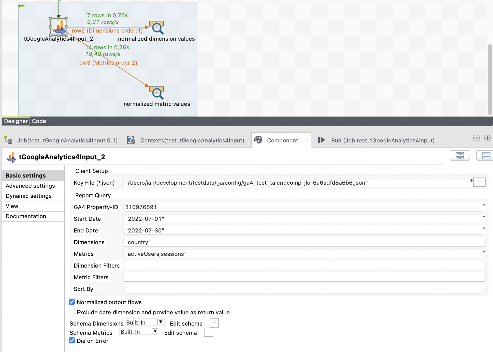
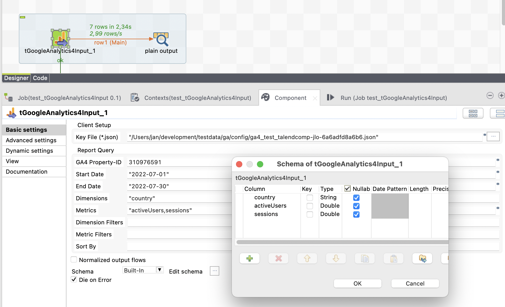

## tGoogleAnalytics4Input

### Overview
Google Analytics 4 (GA4) is the successor of the former Google Analytics (now renamed to Universal Analytics UA).
This component use the latest authorisation method with json key files and therefore simplifies the configuration of the credentials.
Like the predesessor component tGoogleAnalyticsInput this new component provides the possibility of normalised output to build generic job designs.

The setup of filters is now separated in dimension filters and metric filters and the setup is the enabled in the same way as Universal Analytics.
Already existing accounts can be reused. Take care to add the account emails to the new GA4 properties in the authorization setup.

Do not be confused with the new Talend build-in tGoogleAnalyticsReport component. Talends component works only for the now out-dated Google Analytics 3 (Universal Analytics) and will stop working on 1. June 2023.
### Details
* Supports the new Google Analytics 4
* Optional normalised output
* Simplified configuration of account credentials with the standard json key file 
### Images

### Resources
 * <a href=https://github.com/jlolling/talendcomp_tGoogleAnalytics4Input/blob/master/doc/tGoogleAnalytics4Input.pdf>Documentation</a>
 * <a href=https://github.com/jlolling/talendcomp_tGoogleAnalytics4Input/>Source Code</a>

#### Release Notes

##### 1.0 - 2022-08-17 09:43:09
First Release productive used
### Compatible
 - 6.5 (retired)
 -  7.0 (retired)
 -  7.1 (retired)
 - 7.2
 - 7.3
 - 8.0