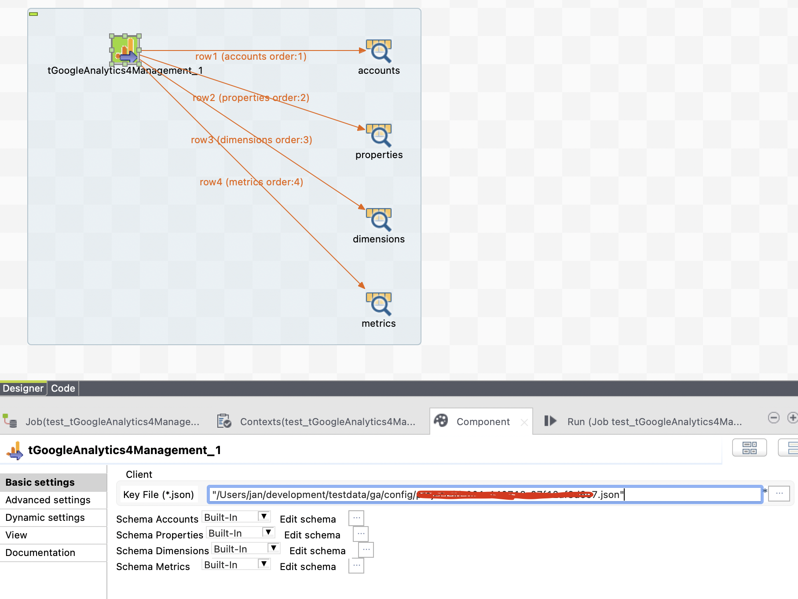

## tGoogleAnalytics4Management

### Overview
This component helps to get the metadata of your GA4 properties into your own database.
The configuration is fairly simple, just reference a credential key json file and thats it. 
Take care the account email is added to your GA4 account.

The component collects:
* GA4 accounts
* GA4 properties
* GA4 dimension (including property specific dimensions)
* GA4 metrics (including property specific metrics)

Because the Google API ist a beta version yet, it will be changed in the future and most likely enhanced.
### Details
* Collects GA4 metadata
### Images

### Resources
 * <a href=https://github.com/jlolling/talendcomp_tGoogleAnalytics4Management>Source Code</a>

#### Release Notes

##### 1.1 - 2022-11-10 22:33:28
* First working version
* Use the latest Google API version beta1
### Compatible
 - 6.5 (retired)
 -  7.0 (retired)
 -  7.1 (retired)
 - 7.2
 - 7.3
 - 8.0