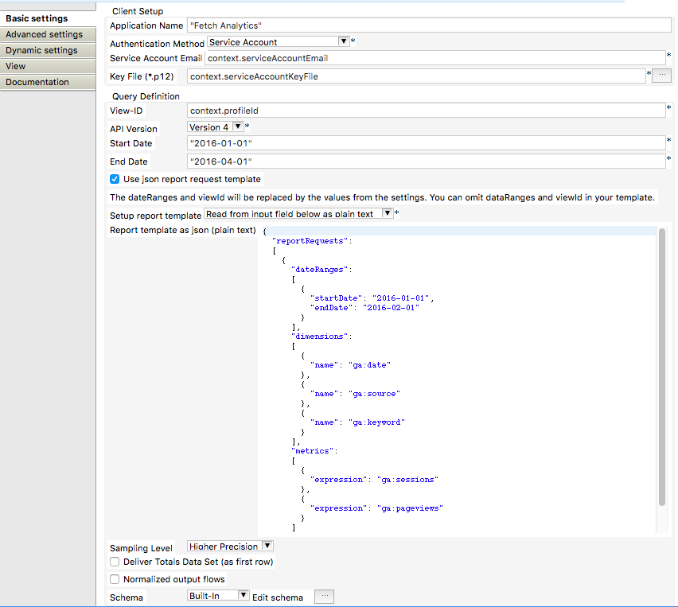

## tGoogleAnalyticsInput

### Overview
This component uses the Google's Core Report API (latest release 4).
You can use different ways to authorize the access:
    * Service Accounts for the enterprise users
    * Client-ID for native application for the semiprofessional usage
    * Can use the current v3 configuratio with v4 of the Analytics API without any changes. Necessary changes to the requests (e.g. the dimension ga:segment) will be added automatically internally. 
The component supports a normalised output to allow persisting the report data in a stable data model without always creating new tables for every new report.
In case of errors (which frequently occurse caused by heavy load on Google's servers) the component tries per default 5 times with an increasing wait time.

It is a good start to check the required query with the API explorer from Google: https://developers.google.com/apis-explorer/#p/

IMPORTANT:
Google has recently introduced a complete new system for Analytics called Google Analytics 4 (GA4). The current system supported by this component is now called Universal Analytics (UA).
### Details
* It is free and Open Source.
* Reports can be configured with all possible dimensions, metrics, filters, segments and sorts
* Uses always the latest Google API
* Reduce sampling with the precision settings
* Returns information about the sampling space and size in case of sampling takes places
* Provides normalised outputs -> allows to persists the data from different reports with different structures creating new tables or change the structure of database tables
* Bullet proof error handling: in case of errors the component waits a bit an retry the requests (configurable)
* Compatible with v4 of the new Analytics API.
* All features of v4 usable by defining the report in the Google API explorer and copy past the json report description in the component.
### Images

### Resources
 * <a href=http://jan-lolling.de/talend/howtos/google_service_account/create-a-google-service-account.html>How to create a Google service account</a>
 * <a href=http://jan-lolling.de/talend/components/help/tGoogleAnalyticsInput.pdf>Documentation</a>
 * <a href=https://github.com/jlolling/talendcomp_tGoogleAnalyticsInput>Source Code on Github</a>

#### Release Notes

##### 8.4 - 2017-06-03 22:07:45
* Google APIs updated
##### 8.5 - 2018-04-16 21:42:55
* Updated Google APIs
* Job Compile problemns solved in case of in one sub job are more than one tGoogleAnalyticsInput component.
##### 8.7 - 2019-09-25 11:57:12
* Google and Apache hhtpclient libs updated to prevent problems running the jobs on AWS
##### 8.8 - 2019-10-27 22:10:58
* compatible to Talend Studio 7.2.x
##### 8.10 - 2020-08-20 21:10:23
* Compatible with Talend 7.3+ because of no lg4j v1 is in use, replaced by sl4j logging
##### 8.11 - 2021-04-06 18:33:32
* Bug fix: When using version 4 of the API the component repeats the query endless if the number of the results is the same as the fetch size. Thanks to Jenny for notifying me about that issue and kindly help testing it.
##### 8.12 - 2021-11-01 19:23:06
* Bug solved: in normalized mode the field ROW_NUM was not set correctly if the raw records was highter than 10000
##### 8.13 - 2021-12-14 15:11:49
* log4j updated to prevent security problems
### Compatible
 - 6.5 (retired)
 -  7.0 (retired)
 -  7.1 (retired)
 - 7.2
 - 7.3
 - 8.0