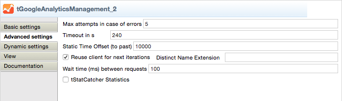

## tGoogleAnalyticsManagement

### Overview
This component uses the Management API to collect all available items for your account like web property, profiles, segments and goals (also with URL destination steps and event conditions).
NEW: provides an output flow with describing information about all available dimensions and metrics (all columns).

NEW: Provides output flows for the user permissions to accounts, web properties and views.
The schemas has been changed (some additional columns added). 
Therefore please remove the component from your job and add it again. Unfortunately I do not know any other way to force the Studio to accept a new fixed defined schema.
### Details
Collect everything whats necessary to have an great overview over the Google Analytics Accounts and all other metadata:
* Accounts
* Web Properties
* Views
* Goals
* Segments
* Dimension and Metrics descriptions
* User Permissions
* Custom Data Sources
* Unsampled Reports
* AdWords account links
* Improved error handling (retries failed attempts multiple times - when it make sense).
### Images

### Resources
 * <a href=https://github.com/jlolling/talendcomp_tGoogleAnalyticsManagement>Source Code on Github</a>
 * <a href=http://jan-lolling.de/talend/components/help/tGoogleAnalyticsManagement.pdf>Documentation</a>
 * <a href=http://jan-lolling.de/talend/howtos/google_service_account/create-a-google-service-account.html>How to create a Google service account</a>

#### Release Notes

##### 5.2 - 2015-04-06 19:44:37
* New output flow: Custom Data Sources added
* Schema changed for the 3 user permission flows
##### 5.3 - 2015-04-20 13:02:24
* Additional advanced setting (time between requests) to setup the time between requests. 
In large enironments the number of views causes a huge number of requests per second and causes Internal Server Errors in Googles API.
##### 5.5 - 2015-04-28 17:38:52
* In case of API errors the component repeats the requests mutliple times (setup in the advanced settings)
##### 6.2 - 2015-06-22 21:47:20
* New output flow for AdWords Links
* New Google API release in use
##### 7.2 - 2019-09-25 12:23:53
* Google and Apche libs updated to prevent problems running the jobs on AWS 
### Compatible
 -  6.1 (obsolete)
 -   6.2 (obsolete)
 -   6.3 (obsolete)
 -   6.4 (obsolete)
 -  6.5 (retired)
 -  7.0 (retired)
 -  7.1 (retired)
 - 7.2
 - 7.3