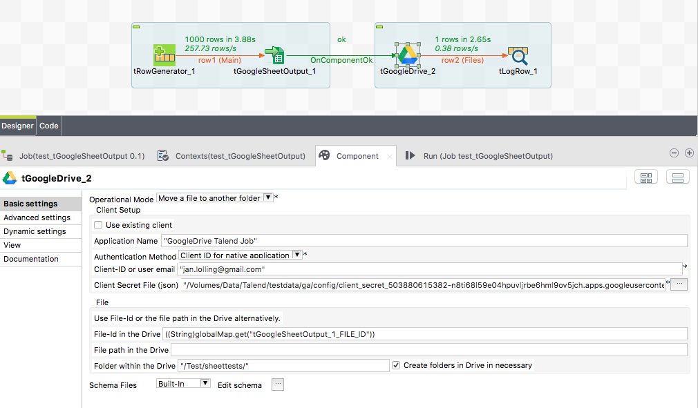

## tGoogleDrive

### Overview
This component manages files and folders on a Google Drive via the Google Drive API v2.
It has various operational modes to:
- upload a file (also with set permissions to other users)
- download a file
- list files (with filtering)
- get the properties of a file/folder
- move files
- delete files

Especially for the usage in conjunction with tGoogleAnalyticsUnsampledReports this component provides the same authentication methods as for the Google Analytics and is able to work directly with file-Ids.
   
Please refer the linked documentation.
For questions and suggestions please contact me: jan.lolling@gmail.com
Please do not use the rating function to post questions.
### Details
* Connect to Google Drive with Client-ID or a Service Account.
* Address files by their document-ID or the label.
* Put, update, get, move, copy, delete, list files
* Add permissions to uploaded files.

### Images

### Resources
 * <a href=http://jan-lolling.de/talend/components/help/tGoogleDrive.pdf>Documentation</a>
 * <a href=http://sourceforge.net/projects/talend-user-components/>Source Code</a>
 * <a href=http://jan-lolling.de/talend/howtos/google_service_account/create-a-google-service-account.html>How to create a Google service account</a>

#### Release Notes

##### 1.4 - 2015-04-20 18:58:06
* Improved capabilities to run in parallisation
* Bug fixed: If one component uses the client from another component and this job is called in an iteration, the client will not be found. 
##### 1.5 - 2015-06-17 15:02:25
* fixed a bug in the Download-Mode: Delete file in Drive does not work properly if the file is addressed by the path in the Driven and not be its Id
* New Google API release used
##### 3.2 - 2017-06-03 10:04:55
* Updated libs to prevent incompatibility with Google AdWords component. 
##### 3.3 - 2018-01-01 00:08:46
* Updated Google Drive API to keep it compatible with the tGoogleSheet* components
##### 3.4 - 2018-02-25 16:08:30
* Bug fix: Delete local file in Upload function caused compile error (Thanks to pswati36)
* Updated Jackson JSON library
##### 3.5 - 2021-12-14 15:14:42
* log4j removed
### Compatible
 - 6.5 (retired)
 -  7.0 (retired)
 -  7.1 (retired)
 - 7.2
 - 7.3
 - 8.0