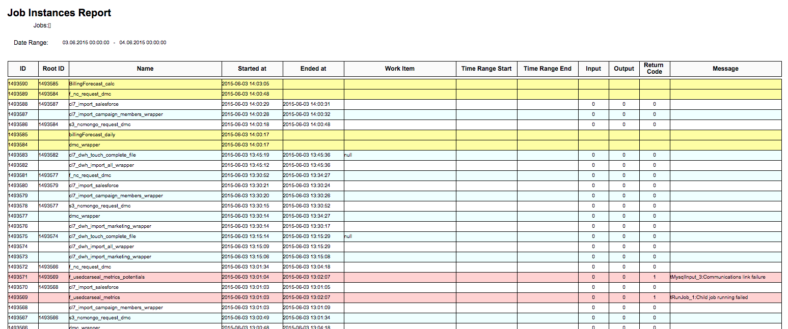
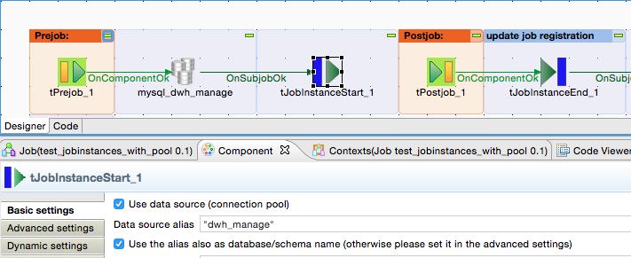

## tJobInstance_component_collection

### Overview
These 4 components:
- tJobInstanceStart
- tJobInstanceEnd
- tJobDataRangeScanner
- tJobInstanceLiveCheck
are dedicated to manage job monitoring.
Helps you to have all essential information for every job run:
What has the job done, what comes in, what is the result...
Where, when, how how runs the jobs....
 
Please refer the linked documentation
The release 3.0 needs slightly changed tables!
Please contact me in case of questions and do not use the rating function to post questions.

### Details
* Creates an job instance Id to mark the datasets for data lineage
* holds all necessary information about a job run in a table
* keeps all context variables in a table (at the job start and its end)
* keeps as much as needed counters from the job
* provides incremental loads
* provides a lot of key figures about the last job run
* keeps the error messages from the job in the status table
* enables Log4J for the job with various outputs and allows using context variables whithin the logging
* Provides maximum memory usage tracking
### Images

### Resources
 * <a href=https://github.com/jlolling/talendcomp_tJobInstance>Source Code on Github</a>
 * <a href=http://jan-lolling.de//talend/cimt_framework/talend_job_instance_components_usecases.pdf>Documentation Concept and Use Cases</a>
 * <a href=https://github.com/jlolling/talendcomp_tJobInstance/blob/master/doc/tJobInstanceStart.pdf>Documentation Components</a>

#### Release Notes

##### 4.3 - 2015-04-15 21:06:58
* More convienent usage of the information about the previous job run by sets of default values for non existing previous runs.
* Improved Log4J setup. Already existing configuration will not be removed but enhanced by additional loggers and appenders, which are automatically cleaned up at the end of the job.
##### 4.5 - 2015-05-16 18:01:39
Fixed issue with not set return value JOB_START_DATE
##### 6.3 - 2017-11-10 07:40:39
* JMX interface to allow read access to the globalMap and the Context of a job.
* Optional auto-generated job instance id
* A lot of bug fixes
##### 6.5 - 2017-12-14 22:32:15
* Bug fixes and performance improvements.
* JMX interface added and improved
##### 7.1 - 2018-10-30 10:45:28
* Save and load context varibales by job_instance_id is removed
* New load of context variables by task name or job name added to provide context variables (especcially dynamic context variables) to the job.
* Snowflake database support added (Snowflake has some JDBC limitations)
##### 7.4 - 2019-01-25 18:54:22
* Improved check if JDBC driver supports return of generated keys.
* Compatible to Snowflake and Exasol now
##### 7.5 - 2019-05-10 11:24:36
* Bugfix for named counters to prevent aggregation over counter with same name but different type
##### 7.7 - 2019-09-20 08:34:00
* Detail counter initial value fixed
##### 7.8 - 2019-11-12 11:13:44
* Compatible with Talend 7.2.x
##### 7.9 - 2020-03-16 12:23:04
* Prevent compile problems for Talend 7.3.1 because of missing Log4J classes
##### 7.10 - 2020-04-14 10:29:47
* Compatibility with Talend 7.3
* Error message improved in case of a child job caused the error. Child job stack trace is now part of the main job error message.
##### 8.2 - 2020-10-19 12:48:29
* Log4J feature removed to get rid of the log4j depenendcy
* Feature of context load removed because it was not really used
* Components can be used now in Talend 7.3+
* Components now compatible with Talend Runtime
##### 8.4 - 2021-12-06 11:30:13
* Labels for input controls improved
* Default values changed to have them more generic
### Compatible
 - 6.5 (retired)
 -  7.0 (retired)
 -  7.1 (retired)
 - 7.2
 - 7.3
 - 8.0