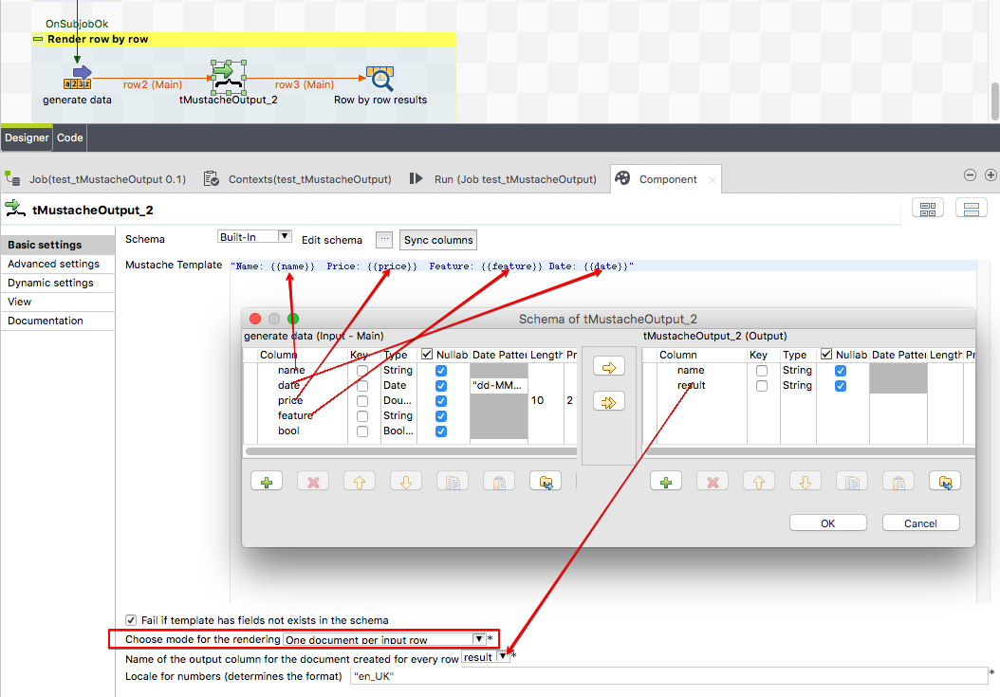

## tMustacheOutput

### Overview
Thgis component allows to render the data in 2 modes:
Mode 1: Every incoming row will be rendered into its own document (row by row). Actually it is also possible to change the template just within the flow.
Mode 2: All incomoing rows will be rendered into one document at the end of the flow.
### Details
* Use Mustache language to build text based documents
* Render all rows at once or every row for itself
* Can check if the template has fields required which does not exist in the incoming schema as column
### Images

### Resources
 * <a href=https://github.com/jlolling/talendcomp_tMustacheOutput/blob/master/doc/tMustacheOutput.pdf>Documentation</a>
 * <a href=https://github.com/jlolling/talendcomp_tMustacheOutput>Source Code</a>

#### Release Notes

##### 1.0 - 2019-05-26 15:39:49
* First tested and productive release
### Compatible
 -  5.6 (obsolete)
 -   6.0 (obsolete)
 -   6.1 (obsolete)
 -   6.2 (obsolete)
 -   6.3 (obsolete)
 -   6.4 (obsolete)
 -  6.5 (retired)
 -  7.0 (retired)
 -  7.1 (retired)
 - 7.2
 - 7.3