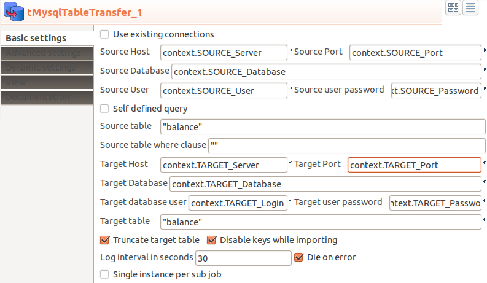

## tMysqlTableTransfer

### Overview
This component is dedicated to transfer the table content from one database to another database.
The component can truncate the target table before or disable all constraints while importing the data.
This component does not care about schema differences. All columns existing in source and target table will be transferred, all other ignored. The necessary schema will be created internally, therefore you have to provide only the source and target table name, thats it.
The component uses asynchronous transfer to half the duration because reading and writing can take place at the same time (or overlapping).
The component provide an optional file output for MySQL bulk load.
### Details
* Read and write in parallel
* Can ignore missing columns
* Do not need to configure a schema
* Can disable indexes while import runs
* Can truncate table before the transfer starts
* Can use data sources
* Can create optional a bulk load file
### Images

### Resources
 * <a href=http://jan-lolling.de/talend/components/help/tMysqlTableTransfer.pdf>Documentation</a>
 * <a href=http://sourceforge.net/projects/talend-user-components/>Source Code</a>

#### Release Notes

##### 9.6 - 2021-12-09 14:19:41
* Fetch column names from select with alias works now correctly
* Set Date typed value for fix column values does not need the manual conversion from java.util.Date to java.sql.Date
##### 10.3 - 2022-06-21 15:21:19
* Log4J removed
* Better handling of date and timestamp types
### Compatible
 - 6.5 (retired)
 -  7.0 (retired)
 -  7.1 (retired)
 - 7.2
 - 7.3
 - 8.0