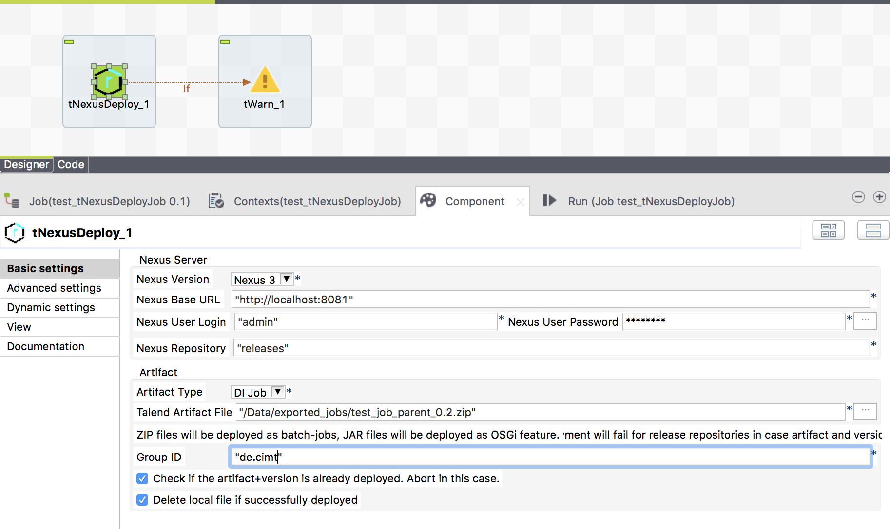

## tNexusDeploy

### Overview
This component supports the deployment to a Nexus container and can detect existing artifacts to prevent failures.
The component supports Nexus 2 and Nexus 3 servers.
The local artifact files can be deleted if the artifact is sucessfully deployed.
### Details
* provides Nexus 2 and Nexus 3
* deploy DI jobs and OSGi bundles
* prevent errors in case the artifact exists already in a release repository
* delete the artifact file if successfully deployed optionally
### Images

### Resources
 * <a href=https://github.com/jlolling/talendcomp_tNexusDeploy>Github source code</a>

#### Release Notes

##### 1.0 - 2020-11-11 21:56:51
* First tested release
### Compatible
 -  6.4 (obsolete)
 -  6.5 (retired)
 -  7.0 (retired)
 -  7.1 (retired)
 - 7.2
 - 7.3