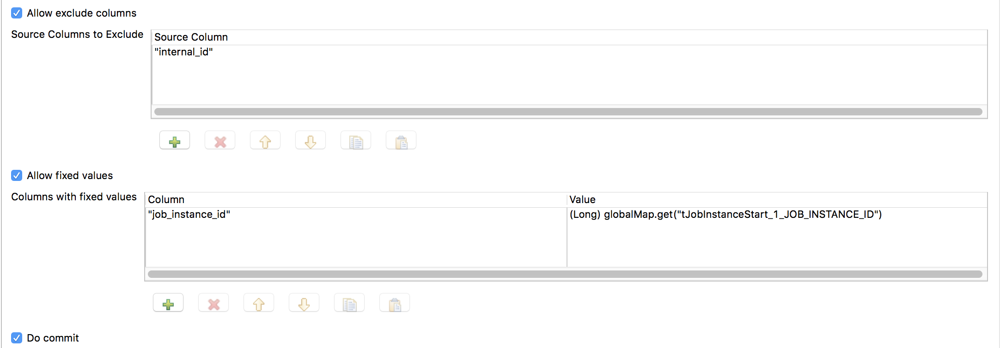
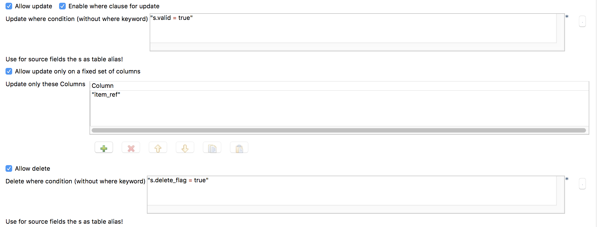
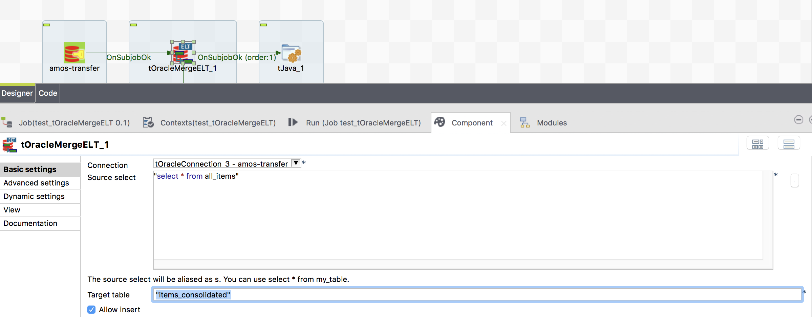
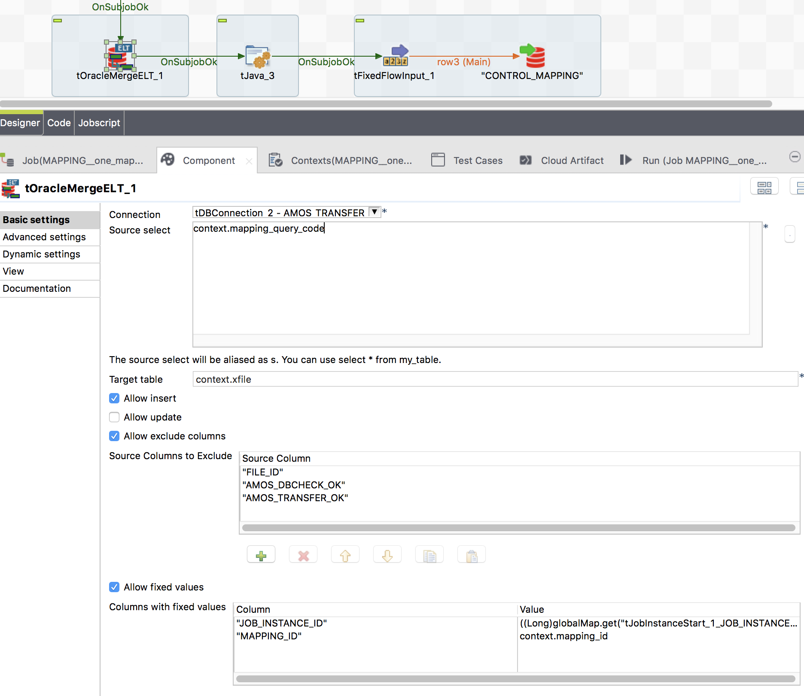

## tOracleMergeELT

### Overview
This component creates and executes an Oracle merge statement based on the meta data of the target table and the source select. 
It does not need a schema and is therefore able to help creating generic job designs.
You can based on a query or simple a source table insert/update or delete records in a target table.
### Details
* Simplest way to use Oracle merge statements in Talend
* Most flexible because no schema needed
* Can exclude columns as well as include columns (carring fixed values)
### Images

### Resources
 * <a href=https://github.com/jlolling/talendcomp_tOracleMergeELT/blob/master/doc/tOracleMergeELT.pdf>Usage Guide</a>
 * <a href=https://github.com/jlolling/talendcomp_tOracleMergeELT>Source Code</a>

#### Release Notes

##### 3.1 - 2020-03-03 22:02:36
* Third productive version.
* Well tested
### Compatible
 -  6.1 (obsolete)
 -   6.2 (obsolete)
 -   6.3 (obsolete)
 -   6.4 (obsolete)
 -  6.5 (retired)
 -  7.0 (retired)
 -  7.1 (retired)
 - 7.2