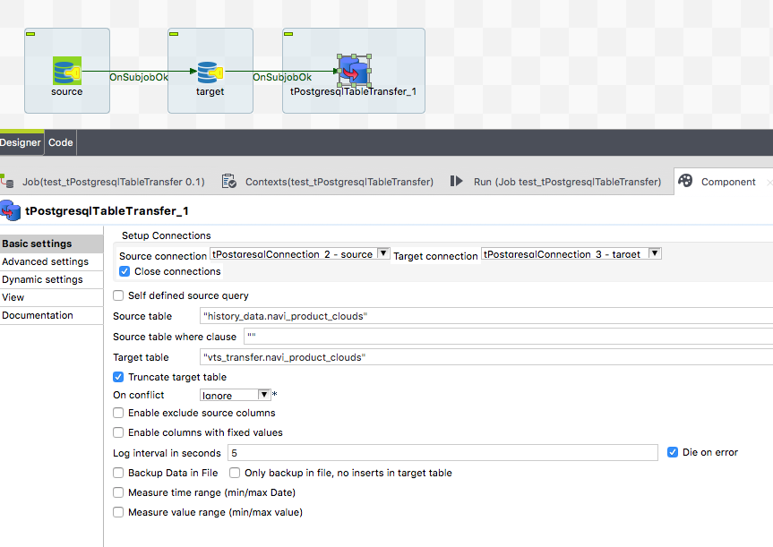

## tOracleTableTransfer

### Overview
This component is dedicated to transfer the table content from one database to another database.
The component can truncate the target table before.
This component does not care about schema differences. 
All columns existing in source and target table will be transferred, all other ignored. The necessary schema will be created internally, therefore you have to provide only the source and target table name, thats it.
The component uses asynchronous transfer to (up to) halve the duration because reading and writing can take place at the same time (or overlapping).
### Details
* schemaless transfer of table data.
* read and write in parallel
* Source database can be any other database type beside Oracle
* Can exclude columns from transfer
* Can include new columns (filled with fixed values)
### Images

### Resources
 * <a href=https://github.com/jlolling/talendcomp_tDBTableTransfer>Source code</a>

#### Release Notes

##### 8.2 - 2020-01-02 17:26:39
* Compatible with Talend 7.2.1
##### 9.2 - 2020-03-03 21:49:03
* Improved performance
* Check target connection frequently (keep a life) for situation the source data query takes very long until data arrives and the target connection is about to be killed be the server because of max idle time
##### 9.3 - 2020-03-12 10:50:19
* Improved performance
* Improved logging, especcially if there are running multiple such components at the same time
* Imporved error handling
##### 9.6 - 2021-12-09 14:19:53
* Fetch column names from select with alias works now correctly
* Set Date typed value for fix column values does not need the manual conversion from java.util.Date to java.sql.Date
### Compatible
 - 6.5 (retired)
 -  7.0 (retired)
 -  7.1 (retired)
 - 7.2
 - 7.3
 - 8.0