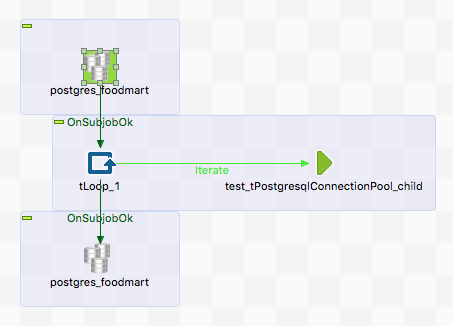

## tPostgresqlConnectionPool

### Overview
This is an implementation of the Apache DBCP2 pool project for PostgreSQL. It provides in a normal DI job the possibility to use a DataSource.
This is a great advantage for jobs which needs a database connection in a rapidely called embedded job. 
The pool has all the necessary features we expect today.
### Details
* Can be used in normal DI jobs
* Can greatly improve the DataSource handling in DI jobs - also for DI made services
* Has a lot of features to take care of the health of the connections
* Can fix the actually wrong behavior of the Talend implementation to handout always the SAME connection instead of a new pooled connection.
### Images

### Resources
 * <a href=https://github.com/jlolling/talendcomp_tDatabaseConnectionPool>Source Code on Github</a>
 * <a href=http://jan-lolling.de/talend/components/help/tPostgresqlConnectionPool.pdf>Documentation</a>

#### Release Notes

##### 2.5 - 2017-11-15 14:05:48
* Compatibility to Talend 6.4
* The pool is now secure against attempts to establish it multiple times with the same JNDI name.
* Closing pool now works also if the pool is not in the same job established.
##### 2.6 - 2017-12-13 21:11:42
* Set the max idle connections to the same value as max total connections to prevent the pool from destroying connections to early without eviction run.
##### 2.7 - 2019-08-13 07:52:29
* Bug fix: Test connection was not closed.
* Bug fixed: Replaced connection does not know its schema
##### 2.8 - 2021-12-14 14:51:58
* Log4J removed
### Compatible
 - 6.5 (retired)
 -  7.0 (retired)
 -  7.1 (retired)
 - 7.2
 - 7.3
 - 8.0