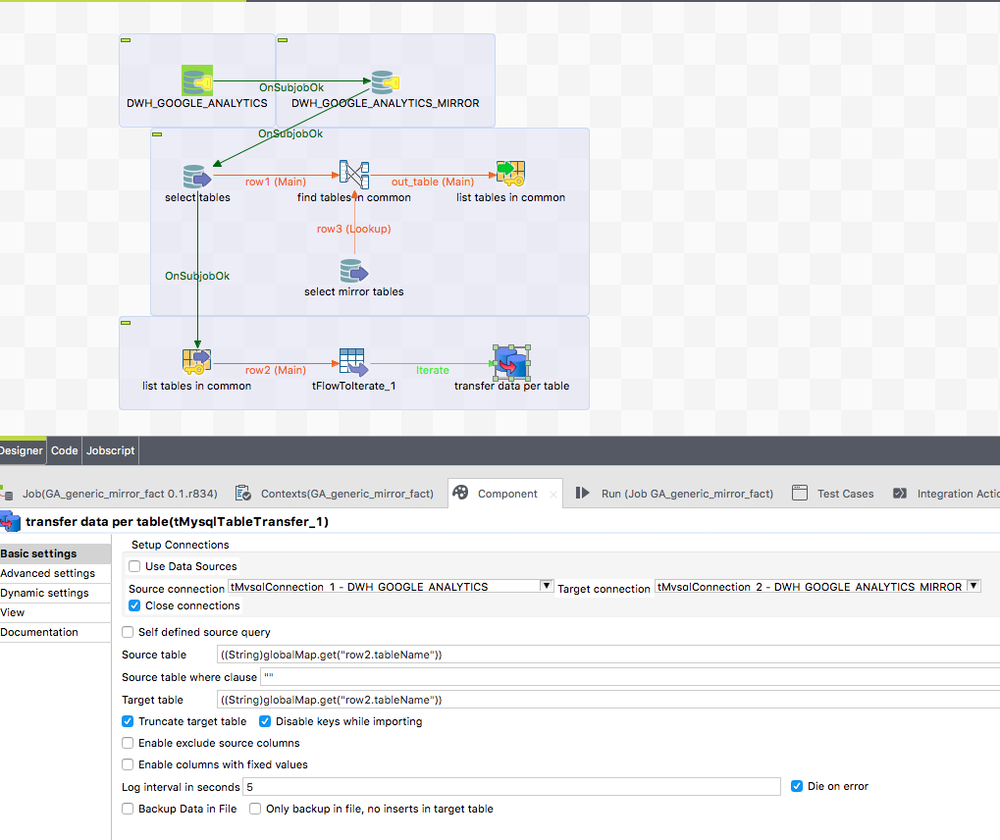

## tPostgresqlTableTransfer

### Overview
This component is dedicated to transfer the table content from one database to another database.
The component can truncate the target table before.
This component does not care about schema differences. All columns existing in source and target table will be transferred, all other ignored. The necessary schema will be created internally, therefore you have to provide only the source and target table name, thats it.
The component uses asynchronous transfer to half the duration because reading and writing can take place at the same time (or overlapping).

### Details
* Table schema not needed. The component detects the fields automatically
* Parallel run of read and write the data - this improves the speed by factor 2 compared to a normal transfer made with input and output components
* Additional fields can be added
* Fields can be excluded from transfer
### Images

### Resources
 * <a href=https://github.com/jlolling/talendcomp_tDBTableTransfer/blob/master/doc/tPostgresqlTableTransfer.pdf>Documentation</a>
 * <a href=https://github.com/jlolling/talendcomp_tDBTableTransfer>Source Code</a>

#### Release Notes

##### 7.2 - 2019-03-28 22:17:12
* Performance improved
* Feature to use Data sources directly removed because of problems and less reliability. Please use t<DB>Connection components to read and write.
##### 9.6 - 2021-12-09 14:20:05
* Fetch column names from select with alias works now correctly
* Set Date typed value for fix column values does not need the manual conversion from java.util.Date to java.sql.Date
### Compatible
 - 6.5 (retired)
 -  7.0 (retired)
 -  7.1 (retired)
 - 7.2
 - 7.3
 - 8.0