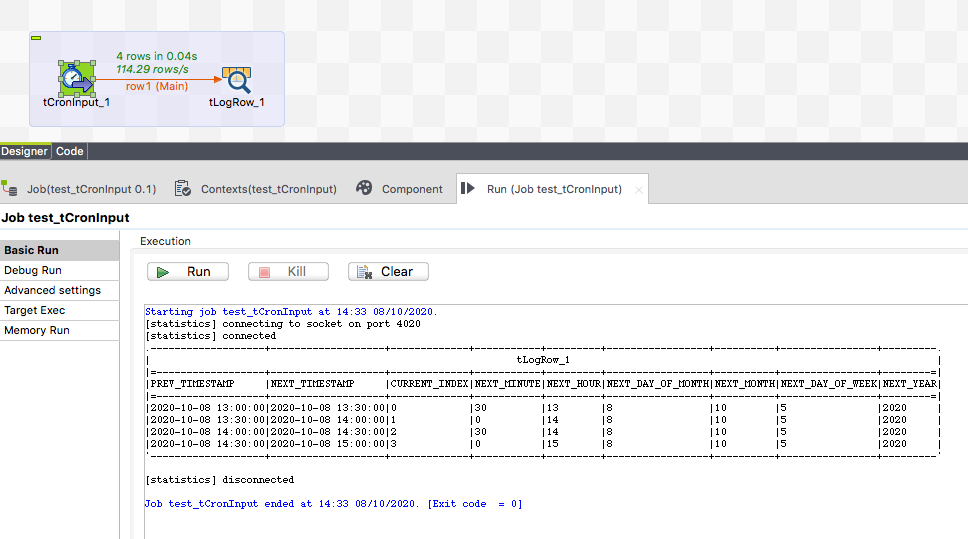
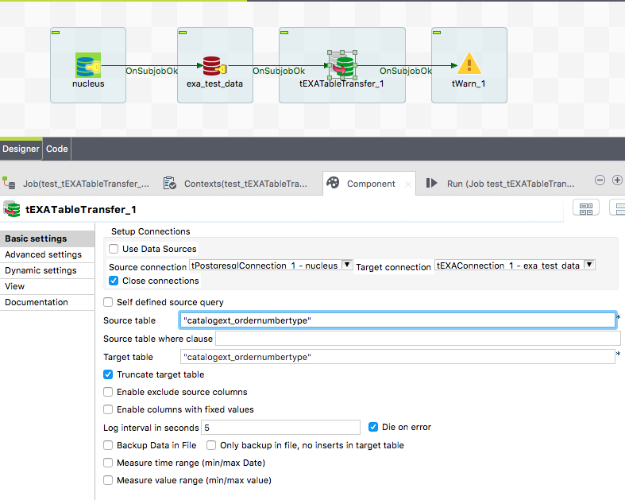
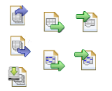
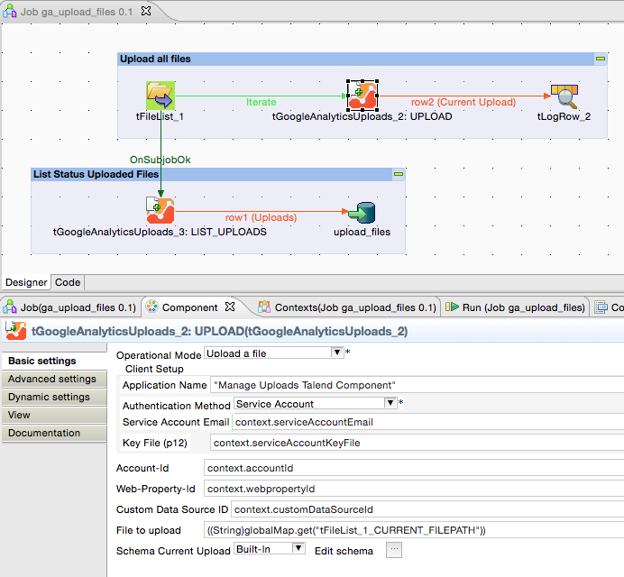
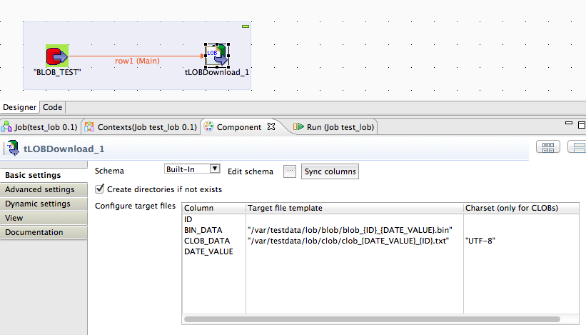
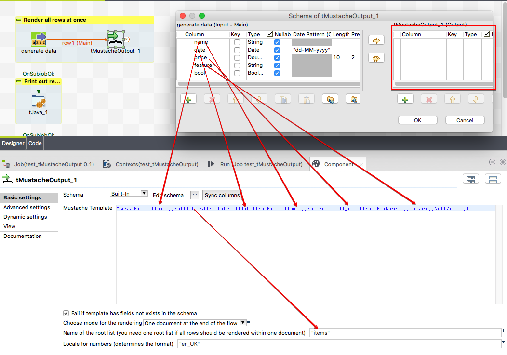
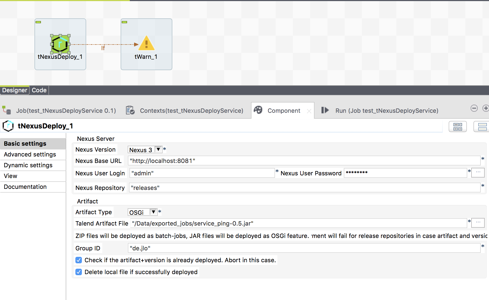
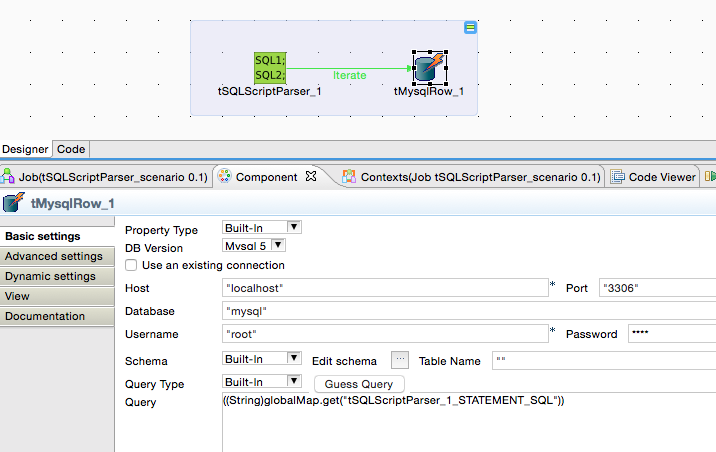

# Jan Lolling
  Located in Berlin, Open Source addicted.
     <http://github.com/jlolling>
  <nospam+jan.lolling@gmail.com>

## <a href='./components/JasperServerFile components/readme.md'> JasperServerFile components</a>
 :white_check_mark: Compatible with Talend 7.x / 8.x 

These component provide the capabilties to handle files on the JasperServer.
They use now the rest-v2 interface and therefore compatible with the current releases of the JaspeServer.
You can do all typical file operations with them.
A typical use case is to send offline generated report result files on a JasperServer.

There are following components
tJasperServer - provides the connection to the JasperServer to share it over multiple components
tJasperServerFilePut - Put a file in the repository
tJasperServerFileGet - Get a file from the repository
tJasperServerFileDelete - Delete a file from the repository
tJasperServerFileCopy - Copy/move a file within the repository
tJasperServerFileList - List files in the repository
tJasperServerClose - Close the explicit connection created by tJasperServer component

## <a href='./components/tCamunda-Components/readme.md'> tCamunda-Components</a>
 :white_check_mark: Compatible with Talend 7.x / 8.x 

Talend Jobs as External Task Worker:
Camunda BPMN offers the feature External Tasks. Such tasks have to solve in external programs to prevent the BPMN engine from stick with expensive resource handling.
The communication to Camunda can be build with native Talend components but this leads to a huge complex job.
Theses components simplifying the task handling and make the available as simple inputs and outputs.

The components provides the tasks simply as input flow and the response to Camunda is simply a output flow (or triggered).
The components also provides error handling and retries in case of communication problems to keep out such complexity from the job.
The external task components provides JMX MBeans providing metrics for all kind of requests and for the actual work.

Talend Job starting a Camunda process instance:
You can start right from the job a Camunda process instance and provide variables for the process and retrieve variables changed within the process.

## <a href='./components/tCamundaDMN/readme.md'> tCamundaDMN</a>
 :white_check_mark: Compatible with Talend 7.x / 8.x 

Run DMN rules in your job with all the power of Camunda DMN. No server needed, the rules will be evaluated locally in your job.
Rules can be provided as dmn file in the file system or as resource in the classpath.

The component contains everything whats needed. No need for external severs or resources (of course the dmn file is needed).

## <a href='./components/tContexrInput/readme.md'> tContexrInput</a>
 :white_check_mark: Compatible with Talend 7.x / 8.x 

Provide a flow containing all context variables of the current job.
Load context variables from various filtered files within multiple directories.
Load context variables from files or directories referenced from context variables
Prevent load context from loading if a parent job has already loaded the context.

In the setting: Context file filters and locations you can add simply directories oder direcxtories + file wildcard filters.
The component will walk through these entries and load the files.

You can also specify a key pattern for properties which points to other property files (or directories) and these files will be read right after reading the current file.

In the outgoing flow of the component you will get all context variables with:
* name
* value
* is the var configured in the current job
* is it a prompt variable
* from which property file was the value finally loaded

## <a href='./components/tCronInput/readme.md'> tCronInput</a>
 :white_check_mark: Compatible with Talend 7.x / 8.x 

This component produces outgoing records with timestamps based on a cron expression.
The prev trigger event timestam and the next expected trigger timestamp will be delivered.
You can configure a start date and/or an end date as time range for which the cron expression will be evaluated.

## <a href='./components/tDB2TableTransfer/readme.md'> tDB2TableTransfer</a>
 :white_check_mark: Compatible with Talend 7.x / 8.x 

This component is dedicated to transfer the table content from one database to another database.
The component can truncate the target table before.
This component does not care about schema differences. All columns existing in source and target table will be transferred, all other ignored. The necessary schema will be created internally, therefore you have to provide only the source and target table name, thats it.
The component uses asynchronous transfer to half the duration because reading and writing can take place at the same time (or overlapping).

## <a href='./components/tElasticSearch-Components/readme.md'> tElasticSearch-Components</a>
 :white_check_mark: Compatible with Talend 7.x / 8.x 

Following components supports the work with ElasticSearch:
tElasticSearchIndexOutput - write documents
tElasticSearchIndexErrors - returns all errors occurs while the last indexing with tElasticSearchIndexOutput
tElasticSearchRequest - Send arbitrary to ElasticSearch

All components provides client based load balancing and failover.
These components uses the latest REST API from ElasticSearch.
The communication can be encrypted and secured with authentication.

## <a href='./components/tEXATableTransfer/readme.md'> tEXATableTransfer</a>
 :white_check_mark: Compatible with Talend 7.x / 8.x 

This component is dedicated to transfer the table content from one database to an EXASolution database.
The component can truncate the target table before.
This component does not care about schema differences. 
All columns existing in source and target table will be transferred, all other ignored. The necessary schema will be created internally, therefore you have to provide only the source and target table name, thats it.
The component uses asynchronous transfer to half the duration because reading and writing can take place at the same time (or overlapping).

The component can also be used to export the data as CSV files dedicated to the bulk import.

You can configure columns as to be excluded from the transfer and as well
you can add aditional columns to the output.

The component can measure for a column the min/max values and return them as return values of this component. This helps to use it in a incremental load scenario.

## <a href='./components/tFileExcel-Components/readme.md'> tFileExcel-Components</a>
 :white_check_mark: Compatible with Talend 7.x / 8.x 

The component suit constists of:
tFileExcelWorkbookOpen - Opens a workbook by reading a file or simply create an empty new one
    * detect automatically the file type - no need to declare it as setting
    * encrypt password secured files
tFileExcelWorkbookSave
    * write a workbook 
    * recalculate all formulas
    * encrypt the file with a password
    * automatically set the necessary file extension
tFileExcelSheetInput - read an Excel sheet with lots of comfort functions
    * Automatic adjustment of the columns to read
    * Read comments
    * Read cell style
    * Read and interpret date formats very tolerant
    * Read only the columns you need
    * Can skip erroneous cell content
tFileExcelSheetInputUnpivot
    * unpivots (or normalize) values from columns which are dynamically and not static
tFileExcelSheetOutput - write Excel sheets
    * write vertically (optional)
    * write only the columns you need
    * recalculate tables if they are affected (and update this way pivot tables)
    * recalculate conditional cell styles
    * apply cell styles from the first (or two) rows
    * apply cell data validation
    * write formulas
    * apply data validation to the new row (taken from the first written row)
    * shift existing row before writing the new row
tFileExcelSheetList
    * List all sheets
    * provide meta information about the sheets
tFileExcelNamedCellInput
    * read named cells
tFileExcelNamedCellOutput
    * write named cells
tFileExcelReferencedCellInput
    * read cells be absolut references
tFileExcelReferencedCellOutput
    * write into absolut referenced cells

## <a href='./components/tFileInputTextFlat/readme.md'> tFileInputTextFlat</a>
 :white_check_mark: Compatible with Talend 7.x / 8.x 

This component is dedicated to read text files. 
The component allows to read text files with not stable structures and provide a feature similar to the dynamic schema but for the Open Studio edition.
The configuration can be read from an external file.

## <a href='./components/tGoogleAdWordsReport/readme.md'> tGoogleAdWordsReport</a>
 :white_check_mark: Compatible with Talend 7.x / 8.x 

This component handles Googles AdWords-API with the latest release v201809.
It authorise the user, executes the report and download the result as text file.
The query can be setup with the AdWords-Query-Language or with given report-type and fields.
To use this component please take care you understand the basics of the AdWordsReports. Refer to the Google description (linked here).
You need:
1. A developer token. You have to order this by Google
2. AdWords account
3. Client-Customer-ID
4. Technical credentials (Service Account or Client-ID for native applications)
The setup procedure in AdWords is not an easy task.
The component can download the report results in the formats CSV or XML. This formats can easily read by the Talend build-in components.
For CSV files the fields are exactly in the order or the AWQL or the give fields in the component.
The result can also send as flow into the job.

## <a href='./components/tGoogleAnalytics4Input/readme.md'> tGoogleAnalytics4Input</a>
 :white_check_mark: Compatible with Talend 7.x / 8.x 

Google Analytics 4 (GA4) is the successor of the former Google Analytics (now renamed to Universal Analytics UA).
This component use the latest authorisation method with json key files and therefore simplifies the configuration of the credentials.
Like the predesessor component tGoogleAnalyticsInput this new component provides the possibility of normalised output to build generic job designs.

The setup of filters is now separated in dimension filters and metric filters and the setup is the enabled in the same way as Universal Analytics.
Already existing accounts can be reused. Take care to add the account emails to the new GA4 properties in the authorization setup.

Do not be confused with the new Talend build-in tGoogleAnalyticsReport component. Talends component works only for the now out-dated Google Analytics 3 (Universal Analytics) and will stop working on 1. June 2023.

## <a href='./components/tGoogleAnalytics4Management/readme.md'> tGoogleAnalytics4Management</a>
 :white_check_mark: Compatible with Talend 7.x / 8.x 

This component helps to get the metadata of your GA4 properties into your own database.
The configuration is fairly simple, just reference a credential key json file and thats it. 
Take care the account email is added to your GA4 account.

The component collects:
* GA4 accounts
* GA4 properties
* GA4 dimension (including property specific dimensions)
* GA4 metrics (including property specific metrics)

Because the Google API ist a beta version yet, it will be changed in the future and most likely enhanced.

## <a href='./components/tGoogleAnalyticsInput/readme.md'> tGoogleAnalyticsInput</a>
 :white_check_mark: Compatible with Talend 7.x / 8.x 

This component uses the Google's Core Report API (latest release 4).
You can use different ways to authorize the access:
    * Service Accounts for the enterprise users
    * Client-ID for native application for the semiprofessional usage
    * Can use the current v3 configuratio with v4 of the Analytics API without any changes. Necessary changes to the requests (e.g. the dimension ga:segment) will be added automatically internally. 
The component supports a normalised output to allow persisting the report data in a stable data model without always creating new tables for every new report.
In case of errors (which frequently occurse caused by heavy load on Google's servers) the component tries per default 5 times with an increasing wait time.

It is a good start to check the required query with the API explorer from Google: https://developers.google.com/apis-explorer/#p/

IMPORTANT:
Google has recently introduced a complete new system for Analytics called Google Analytics 4 (GA4). The current system supported by this component is now called Universal Analytics (UA).

## <a href='./components/tGoogleAnalyticsManagement/readme.md'> tGoogleAnalyticsManagement</a>
 :white_check_mark: Compatible with Talend 7.x / 8.x 

This component uses the Management API to collect all available items for your account like web property, profiles, segments and goals (also with URL destination steps and event conditions).
NEW: provides an output flow with describing information about all available dimensions and metrics (all columns).

NEW: Provides output flows for the user permissions to accounts, web properties and views.
The schemas has been changed (some additional columns added). 
Therefore please remove the component from your job and add it again. Unfortunately I do not know any other way to force the Studio to accept a new fixed defined schema.

## <a href='./components/tGoogleAnalyticsUnsampledReports/readme.md'> tGoogleAnalyticsUnsampledReports</a>
 :warning: Compatibility not known

This component managed un-sampled reports for Google Analytics.
It can only be used with a Google Analytics Premium Account.
It is recommended to take care the reports needs to be treated this way because the quotas for un-sampled reports are much lower than for normal reports.
It is a good practice to run the report first as normal reports with tGoogleAnalyticsInput and check the sampling state and decide which reports needs to run as un-sampled reports.
Un-sampled reports are treated in an asynchronous process. Everything whats necessary to do the steps are build-in in this component, except the download of the files. Please us the new component tGoogleDrive to do this.

Please read the linked documentation. The procedure is a bit complex!

In case of questions feel free to contact me: jan.lolling@gmail.com

## <a href='./components/tGoogleAnalyticsUploads/readme.md'> tGoogleAnalyticsUploads</a>
 :warning: Compatibility not known

Google Analytics provides the possibility to upload files into so called custom data sources. 
These custom data sources can be used to merge company key figures with Google Analytics key figures.
This component provides an easy way to upload files into custom data sources.

## <a href='./components/tGoogleDrive/readme.md'> tGoogleDrive</a>
 :white_check_mark: Compatible with Talend 7.x / 8.x 

This component manages files and folders on a Google Drive via the Google Drive API v2.
It has various operational modes to:
- upload a file (also with set permissions to other users)
- download a file
- list files (with filtering)
- get the properties of a file/folder
- move files
- delete files

Especially for the usage in conjunction with tGoogleAnalyticsUnsampledReports this component provides the same authentication methods as for the Google Analytics and is able to work directly with file-Ids.
   
Please refer the linked documentation.
For questions and suggestions please contact me: jan.lolling@gmail.com
Please do not use the rating function to post questions.

## <a href='./components/tGoogleSheet components/readme.md'> tGoogleSheet components</a>
 :white_check_mark: Compatible with Talend 7.x / 8.x 

* supports service accounts as well as application-client-ID as authentication method (2-factor)

tGoogleSheetInput
* has capabilities to configure the correct column position by the header line
* can parse dates tolerant

tGoogleSheetOutput
* Can create Google Sheet documents
* Can create sheets
* write into sheets

To read or write into existing documents these components expects the File-ID. To get this use tGoogleDrive (from Talend Exchange) or the build-in tGoogleDriveList (with less funtionality).

## <a href='./components/tJasperReportExec/readme.md'> tJasperReportExec</a>
 :white_check_mark: Compatible with Talend 7.x / 8.x 

This component can use a local jrxml file and compiles, fills and exports the report in a Talend job without a JasperServer.

It detect the need of compiling the report as well as subreports.

It uses the JasperLibrary 6.15.0 - used in the latest Jasper Studio 7

If you need Barcodes you have to add all necessary libraries with tLoadLibrary and it will work.
Please refer to the linked documentation to get more information about the necessary libraries and how to setup them.
Unlike the build in components tJasperOutput this component can use all typical data sources:
* JDBC connection (all possible database connections from Talend are enabled)
* XML files
* CSV files
* Dummy records for reports which gets its values from other sources e.g. in sub reports.

The component supports Jasper Report Books. A very nive design template to build highly complex reports.
You can set parameters and you can use resource bundles.
Please take care building a report with the correct compatibility settings inn Jaspersoft Studio. 
Please refer to the linked documentation how to do that. 

## <a href='./components/tJobInstance_component_collection/readme.md'> tJobInstance_component_collection</a>
 :white_check_mark: Compatible with Talend 7.x / 8.x 

These 4 components:
- tJobInstanceStart
- tJobInstanceEnd
- tJobDataRangeScanner
- tJobInstanceLiveCheck
are dedicated to manage job monitoring.
Helps you to have all essential information for every job run:
What has the job done, what comes in, what is the result...
Where, when, how how runs the jobs....
 
Please refer the linked documentation
The release 3.0 needs slightly changed tables!
Please contact me in case of questions and do not use the rating function to post questions.

## <a href='./components/tJSONDoc* components/readme.md'> tJSONDoc* components</a>
 :white_check_mark: Compatible with Talend 7.x / 8.x 

This suite constists of these components:
tJSONDocOpen - the basis of all other components. It represents the JSON document it self, all other components are dedicated to work with this document
tJSONDocInput - read from an object or an array
tJSONDocInputStream - read very large json files as stream
tJSONDocOutput - create the sub elements of the JSON document and write the attributes of Objects or values of arrays.
tJSONDocSave - render and format the final document and provide the content to a flow or a file.
tJSONDocMerge - merge json documents by key attributes and json-path
tJSONDocDiff - compares 2 json documents and returns the differences as input flow in detail
tJSONDocTraverseFields - returns as flow all fields of all objects and arrays in a complex json document.
tJSONDocValidationInput - returns a flow containing all details to problems detected within a json schema validation

Then idea behind these components is to read or build your json document in multiple steps right where you need or fetch the necessary data.
The components can refer to eachother and use this way the current json node of the referenced component to dock on and start working here.

Many thanks to my customer GVL in Berlin (Martin, Karim and Ralf) and my colleagues from the cimt AG for their great support by ideas and tests.

## <a href='./components/tJsonNormalize/readme.md'> tJsonNormalize</a>
 :white_check_mark: Compatible with Talend 7.x / 8.x 

It normalizes JSON objects (received as text column or from a MongoDB).
The component goes recursive through the JSON object and returns all simple values (also in arrays) with the value, and the path the the attribute.

Documentation: http://jan-lolling.de/talend/components/help/tJsonNormalize.pdf

## <a href='./components/tLOBDownload/readme.md'> tLOBDownload</a>
 :white_check_mark: Compatible with Talend 7.x / 8.x 

This component downloads a LOB (BLOB or CLOB) object.
For CLOB content you can set a charset because the CLOBs like BLOBs are always byte streams.
Select in a query the BLOB or CLOB columns and setup for these columns file names where the content have to be downloaded. 
The file names can contains placeholders referring to other columns (e.g. IDs or if the file name is also stored in a column).

## <a href='./components/tMustacheOutput/readme.md'> tMustacheOutput</a>
 :white_check_mark: Compatible with Talend 7.x / 8.x 

Thgis component allows to render the data in 2 modes:
Mode 1: Every incoming row will be rendered into its own document (row by row). Actually it is also possible to change the template just within the flow.
Mode 2: All incomoing rows will be rendered into one document at the end of the flow.

## <a href='./components/tMysqlConnectionPool/readme.md'> tMysqlConnectionPool</a>
 :white_check_mark: Compatible with Talend 7.x / 8.x 

This is an implementation of the Apache DBCP2 pool project for MySQL. It provides in a normal DI job the possibility to use a DataSource.
This is a great advantage for jobs which needs a database connection in a rapidely called embedded job. 
The pool has all the necessary features we expect today.

## <a href='./components/tMysqlTableTransfer/readme.md'> tMysqlTableTransfer</a>
 :white_check_mark: Compatible with Talend 7.x / 8.x 

This component is dedicated to transfer the table content from one database to another database.
The component can truncate the target table before or disable all constraints while importing the data.
This component does not care about schema differences. All columns existing in source and target table will be transferred, all other ignored. The necessary schema will be created internally, therefore you have to provide only the source and target table name, thats it.
The component uses asynchronous transfer to half the duration because reading and writing can take place at the same time (or overlapping).
The component provide an optional file output for MySQL bulk load.

## <a href='./components/tNexusDeploy/readme.md'> tNexusDeploy</a>
 :white_check_mark: Compatible with Talend 7.x / 8.x 

This component supports the deployment to a Nexus container and can detect existing artifacts to prevent failures.
The component supports Nexus 2 and Nexus 3 servers.
The local artifact files can be deleted if the artifact is sucessfully deployed.

## <a href='./components/tOracleMergeELT/readme.md'> tOracleMergeELT</a>
 :white_check_mark: Compatible with Talend 7.x / 8.x 

This component creates and executes an Oracle merge statement based on the meta data of the target table and the source select. 
It does not need a schema and is therefore able to help creating generic job designs.
You can based on a query or simple a source table insert/update or delete records in a target table.

## <a href='./components/tOracleTableTransfer/readme.md'> tOracleTableTransfer</a>
 :white_check_mark: Compatible with Talend 7.x / 8.x 

This component is dedicated to transfer the table content from one database to another database.
The component can truncate the target table before.
This component does not care about schema differences. 
All columns existing in source and target table will be transferred, all other ignored. The necessary schema will be created internally, therefore you have to provide only the source and target table name, thats it.
The component uses asynchronous transfer to (up to) halve the duration because reading and writing can take place at the same time (or overlapping).

## <a href='./components/tPostgresqlConnectionPool/readme.md'> tPostgresqlConnectionPool</a>
 :white_check_mark: Compatible with Talend 7.x / 8.x 

This is an implementation of the Apache DBCP2 pool project for PostgreSQL. It provides in a normal DI job the possibility to use a DataSource.
This is a great advantage for jobs which needs a database connection in a rapidely called embedded job. 
The pool has all the necessary features we expect today.

## <a href='./components/tPostgresqlTableTransfer/readme.md'> tPostgresqlTableTransfer</a>
 :white_check_mark: Compatible with Talend 7.x / 8.x 

This component is dedicated to transfer the table content from one database to another database.
The component can truncate the target table before.
This component does not care about schema differences. All columns existing in source and target table will be transferred, all other ignored. The necessary schema will be created internally, therefore you have to provide only the source and target table name, thats it.
The component uses asynchronous transfer to half the duration because reading and writing can take place at the same time (or overlapping).

## <a href='./components/tSQLScriptParser/readme.md'> tSQLScriptParser</a>
 :white_check_mark: Compatible with Talend 7.x / 8.x 

This component can iterate through SQL statements in a script read from the SQL input in the component or from a file.
It detects the OraclePlus delimiter / to separate complex statements like begin-end or create or replace procedure etc.

The current statement can be retrieved with the return value (see the Outline view) e.g. ((String)globalMap.get("tSQLScriptParser_1_STATEMENT_SQL")).
A common use case is to trigger a tMysqlRow with the Iterate flow and use in the Row component as query ((String)globalMap.get("tSQLScriptParser_1_STATEMENT_SQL")).
Take care you do not put this expression NOT in quotas unlike you would do for SQL code.

## <a href='./components/tYoutubeAnalyticsInput/readme.md'> tYoutubeAnalyticsInput</a>
 :white_check_mark: Compatible with Talend 7.x / 8.x 

This component collect analytics data for YouTube.
It uses the latest Google API to collect the data.
The setup of the account and authorisation is not trivial. 
Please take a look at the documentation linked here.
Many thanks to Alvaro for sharing ideas and test support.

New API revision used
Documentation improved with more information how to configure and hints in case of problems.

Documentation: http://jan-lolling.de/talend/components/help/tYoutubeAnalyticsInput.pdf

