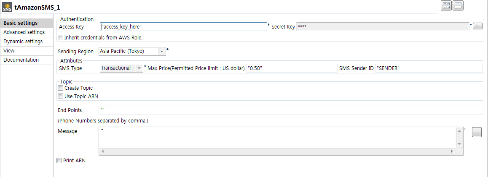
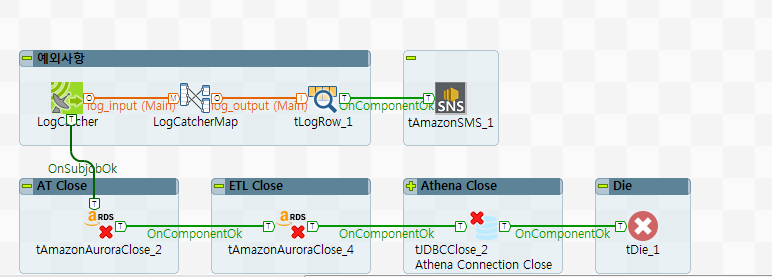
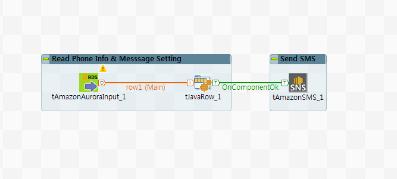

## AmazonSMS

### Overview
This component offers to send SMS to endpoint someone or other ones.
Based on Amazon SNS service, therefore it is able to using some option by amazon SNS service.
### Details
SMS is very fast and efficiant way that people be noticed information.
if your Job on AWS, This component is best way how infomation is delivered user and admin immediatly.
### Images

### Install Instructions
Download actifacts. 
Exetract the component from zip compressed file to temp folder. 
Copy contents of temp folder to TOS components folder where plug-in’s placed. 
And then restart TOS.
Dive into

#### Release Notes

##### 1.00 - 2018-10-17 08:24:51
Release Ver. 1.00
First draft of the component.

* Used library
aws-java-sdk-1.11.358.jar
aws-sns-0.9.1.jar
commons-logging-1.2.jar
httpclient-4.5.5.jar
httpcore-4.4.9.jar
jackson-annotations-2.6.0.jar
jackson-core-2.6.7.jar
jackson-databind-2.6.7.1.jar
joda-time-2.8.1.jar
### Compatible
 -  6.0 (obsolete)
 -   6.1 (obsolete)
 -   6.2 (obsolete)
 -   6.3 (obsolete)
 -   6.4 (obsolete)
 -  6.5 (retired)
 -  7.0 (retired)
 -  7.1 (retired)