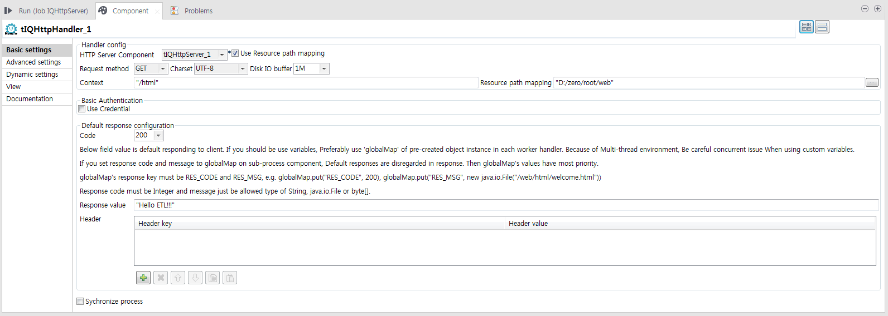
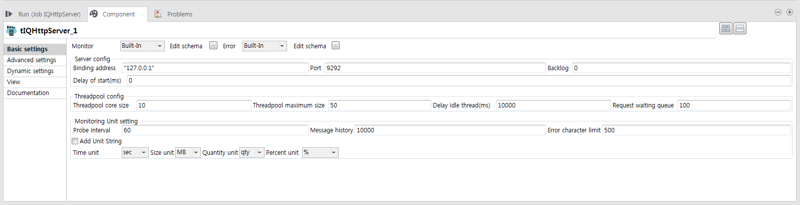
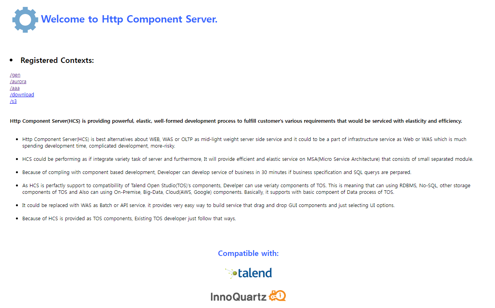
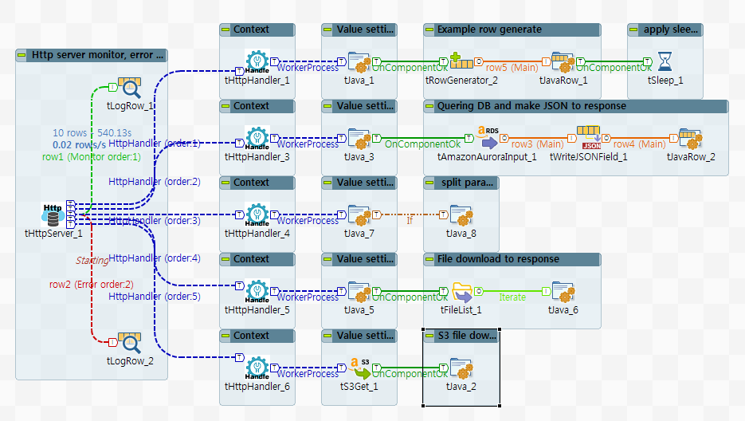

## Http Components

### Overview
Http Component Server(HCS) is providing powerful, elastic, well-formed development process to fulfill customer's various requirements that would be serviced with elasticity and efficiency. 
HCS is best alternatives about WEB, WAS or OLTP as mid-light weight server side service and it could to be a part of infrastructure service as Web or WAS which is much spending development time, complicated development, more-risky. 
HCS could be performing as if integrate variety task of server and furthermore, It will provide efficient and elastic service on MSA(Micro Service Architecture) that consists of small separated module.
Because of compling with component based development, Developer can develop service of business in 30 minutes if business specification and SQL querys are perpared.
As HCS is perfactly support to compatibillity of Talend Open Studio(TOS)'s components, Develper can use veriaty components of TOS. This is meaning that can using RDBMS, No-SQL, other storage components of TOS and Also can using On-Premise, Big-Data, Cloud(AWS, Google) components. Basically, it supports with basic compoent of Data process of TOS.
It could be replaced with WAS as Batch or API service. it provides very easy way to build service that drag and drop GUI components and just selecting UI options. 
Because of HCS is provided as TOS components, Existing TOS developer just follow that ways.

### Details
1. Alternatives Web/WAS.
2. Alternatives API/Batch Server.
2. Simple, Powerful and efficient components for server side service.
3. Because of complying formal component development, it takes very low risk.
4. As components based on Talend Open Studio, you can use almost of all of Talend Components.
5. More speedy and elastic development.
### Images

### Install Instructions
Download actifacts. 
Exetract the component from zip compressed file to temp folder. 
Copy contents of temp folder to TOS components folder where plug-in’s placed. 
And then restart TOS.
Dive into
### Resources
 * <a href=www.chaostocosmos.org>HttpComponents</a>

#### Release Notes

##### 0.90 - 2019-03-12 07:00:40
Release Ver. 0.90
First draft of the component.
No limitation and charging.

* Used library
chaos.http.0.9b.jar
commons-fileupload-1.4.jar
commons-io-2.6.jar
image4j-0.7.2.jar
servlet.jar
### Compatible
 -  6.0 (obsolete)
 -   6.1 (obsolete)
 -   6.2 (obsolete)
 -   6.3 (obsolete)
 -   6.4 (obsolete)
 -  6.5 (retired)
 -  7.0 (retired)
 -  7.1 (retired)