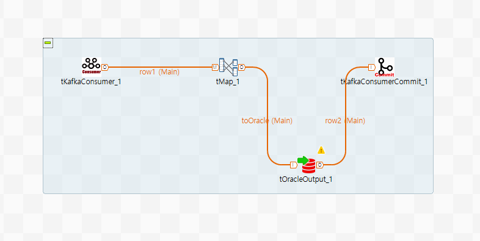

## Kafka Bunch

### Overview
This product consist of three component and able to publish/consumer/commit to Kafka server.
tKafkaProducer is able to publish messages to Kafka server and able with various option of Kafka.
tKafKaConsumer is functioning to consume message from Kafka server with the topic and partitions. It can be run to subscribe or assign by option and run like daemon or can be set to terminate option.
tKafkaConsumerCommit is to commit to kafka server with option that sync or async and can be set by specific partition's offset.
### Details
* It's provide very useful functionalites for Kafka streaming based workload.
* It's support of almost kind of Kafka options.
* Publisher support to compress messages with gzip/snnapy/lz4/zstd.
* Consumer provide subscribe or assign option that be run with that mode. subscription mode be run with topic and assignment mode be run with being assigned with specific partition.
* Consumer is support to infinite runing or to terminate by condition option.
* Commit is support to commit with specific offset of partitions.
### Images

### Install Instructions
Download this artifact.
Extract component files from zip file of that.
Copy extracted files to component directory of TOS plugin or custom component directory.
Restart TOS.
And dive into it.
### Resources
 * <a href=https://kafka.apache.org/>Apache Kafka</a>

#### Release Notes

##### 0.93B - 2020-07-06 05:58:14
First draft.
### Compatible
 -  6.3 (obsolete)
 -   6.4 (obsolete)
 -  6.5 (retired)
 -  7.0 (retired)
 -  7.1 (retired)
 - 7.2
 - 7.3