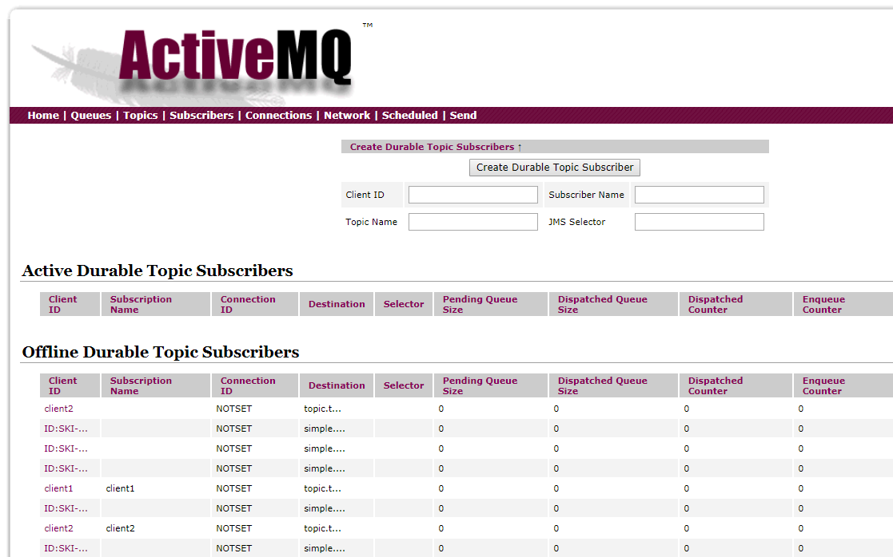
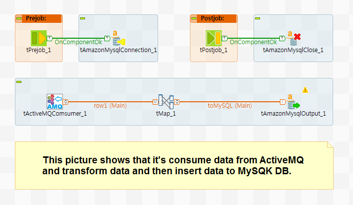
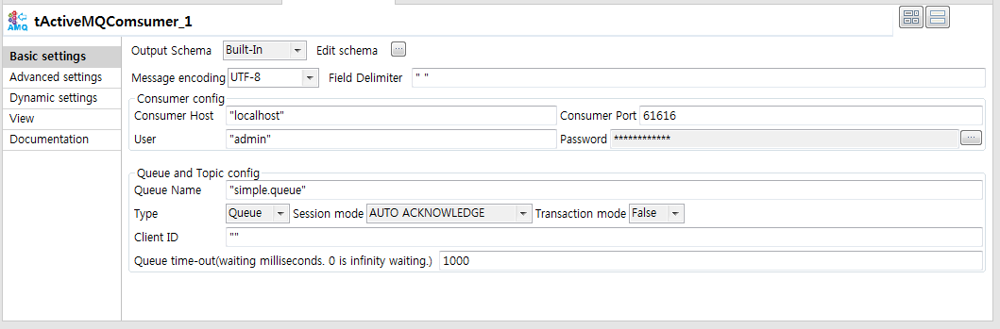

## tActiveMQConsumer

### Overview
This component contribute to publish ActiveMQ message through Talend job.
You can able to manipulate message with schema-based data process.
You can also control many options for receiving message process and so you can configure proper contition for your system.
### Details
To control text message with schema-based format handling. 
To use ActiveMQ’s authentication. 
To set Queue or Topic mode. 
To set receive message timeout, so you can run job for waiting message infinitly(set to 0) or util timeout.
To set various option for message handling. 
To use many other components on TOS together. 
To use stream-based architecture.
To use stream-based DataLake architecture.
### Images

### Install Instructions
Download actifacts. 
Exetract the component from zip compressed file to temp folder. 
Copy contents of temp folder to TOS components folder where plug-in’s placed. 
And then restart TOS.
Dive into.
### Resources
 * <a href=http://www.chaostocosmos.org/>Author page.</a>
 * <a href=http://activemq.apache.org/components/classic/download/>ActiveMQ Download page.</a>
 * <a href=http://activemq.apache.org/>ActiveMQ Homepage.</a>

#### Release Notes

##### 0.90 - 2019-05-02 06:33:52
Release Ver. 0.90
First draft of the component.

- Used library
activemq-client-5.13.0.jar
geronimo-j2ee-management_1.1_spec-1.0.1.jar
geronimo-jms_1.1_spec-1.1.1.jar
slf4j-api-1.7.13.jar
### Compatible
 -  6.0 (obsolete)
 -   6.1 (obsolete)
 -   6.2 (obsolete)
 -   6.3 (obsolete)
 -   6.4 (obsolete)
 -  6.5 (retired)
 -  7.0 (retired)
 -  7.1 (retired)