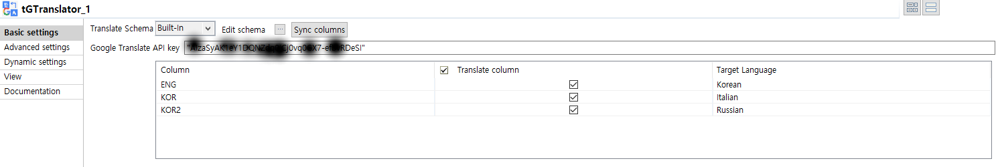
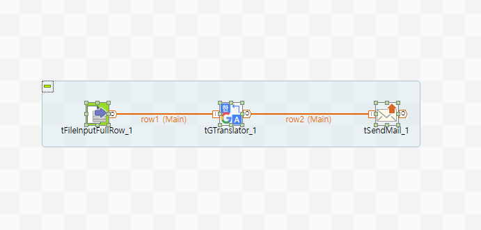
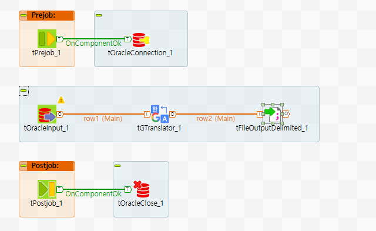

## tGTranslator

### Overview
This component contributes to translate text by Gooogle translate API.
You can choose language that will be translated on each column of Schema and you will be obtain translated text.
Also the component supports 64 language to translate.
### Details
To translate with Google translate API.(of goood quality)
To support 64 different language.
To choose language each of column of schema.
### Images

### Install Instructions
Download actifacts. 
Exetract the component from zip compressed file to temp folder. 
Copy contents of temp folder to TOS components folder where plug-in’s placed. 
And then restart TOS. 
Dive into.

### Resources
 * <a href=https://cloud.google.com/translate/docs/>Google Translate API</a>
 * <a href=https://cloud.google.com/translate/docs/translating-text?hl=ko>Google Cloud Translate</a>

#### Release Notes

##### 0.93A - 2019-09-05 04:51:48
First release. Ver. 0.93A
### Compatible
 -  6.0 (obsolete)
 -   6.1 (obsolete)
 -   6.2 (obsolete)
 -   6.3 (obsolete)
 -   6.4 (obsolete)
 -  6.5 (retired)
 -  7.0 (retired)
 -  7.1 (retired)
 - 7.2