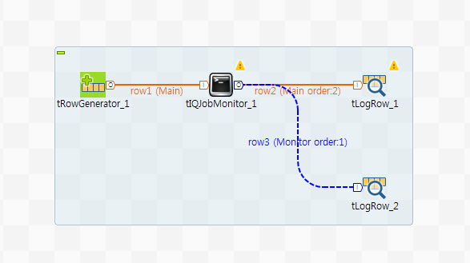
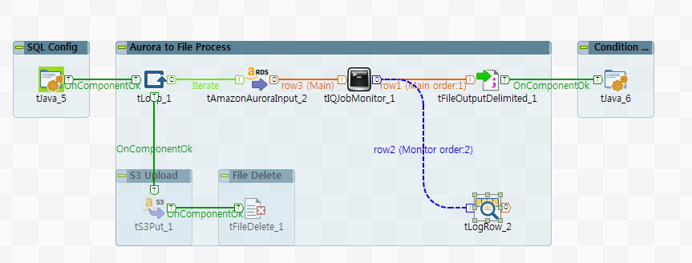

## tJobMonitor

### Overview
This component support that admin will be known infomation of job and system resources by various option, measured value, the numbers.
You can setting various unit and selecting resource options.
This able to setting periodic probe point, measured data unit, and memory & CPU resource of job and system.
### Details
1. Setting probe period of monitoring
2. Selection of whether output Standard IO
3. Various statistics oprions of monitoring
4. Various memory & CPU measuring options
5. Saving to file of measured values

Monitoring option details belows.
1. Probe period : setting period of probing
2. Print STD out : whether print to Standard IO
3. Include unit string : whether print unit string
4. Unit setting : setting each measured unit
5. Job monitoring option : check option about job
6. Memory monitoring option : check option about memory factor of job and system
7. CPU Monitoring option : check option about CPU factor of job and system
### Images

### Install Instructions
Download actifacts. 
Exetract the component from zip compressed file to temp folder. 
Copy contents of temp folder to TOS components folder where plug-in’s placed. 
And then restart TOS.
Dive into

#### Release Notes

##### 0.9 - 2018-12-13 05:13:44
First release of tJobMonitor.
Monitoring Job and system.
##### 1.00 - 2019-04-15 06:05:00
Release ver. 1.00

1. This version is enable to be startable component.
2. Add option that configure log split size.
### Compatible
 -  6.0 (obsolete)
 -   6.1 (obsolete)
 -   6.2 (obsolete)
 -   6.3 (obsolete)
 -   6.4 (obsolete)
 -  6.5 (retired)
 -  7.0 (retired)
 -  7.1 (retired)