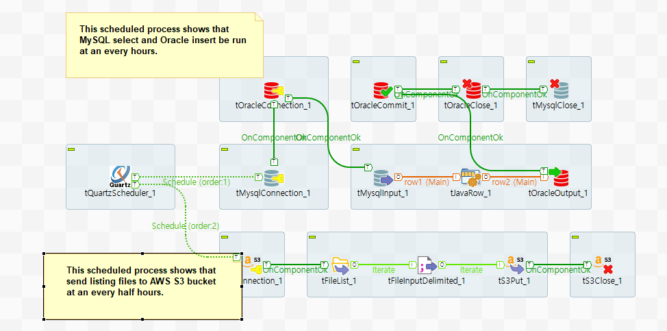
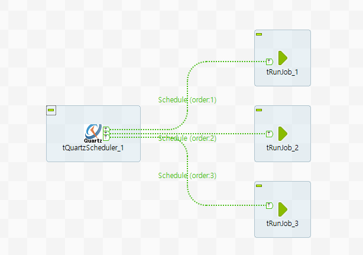

## tQuartzScheduler

### Overview
This component contribute to schedule multiple components process in a Talend job.

This component is bounded on Quartz Scheduler which is mostly used as scheduling working process as open-source library.
you can schedule various working bunch of Talend components by cron expression.
because of this, able to schedule multiple components in one job, It can be used as scheduling server of component groups or sub job.
basically, Talend job is based on single batch process but by using this component, you can create to compose concurrently different scheduled job process.
the scheduler is worked with defining cron expression and the component provide two different ways to define cron expression that is showed on basic setting in Talend Open Studio.
### Details
To schedule multiple components.
To use cron expressions.
To make multiple process in one job.
To make to schedule multiple sub jobs.
As use Quartz library, more reliable and precise.
### Images

### Install Instructions
Download actifacts.
Exetract the component from zip compressed file to temp folder.
Copy contents of temp folder to TOS components folder where plug-in’s placed.
And then restart TOS.
Dive into.
### Resources
 * <a href=http://www.quartz-scheduler.org/>Quartz Enterprise</a>

#### Release Notes

##### 0.94 - 2019-12-27 06:14:14
First release of QuartScheduler Ver. 0.93
To Schedule process by cron expr.
To be server system for multi batch proess.

2019/12/27 - To fix can’t use variable, like context, at cron expression.

### Compatible
 -  6.0 (obsolete)
 -   6.1 (obsolete)
 -   6.2 (obsolete)
 -   6.3 (obsolete)
 -   6.4 (obsolete)
 -  6.5 (retired)
 -  7.0 (retired)
 -  7.1 (retired)
 - 7.2