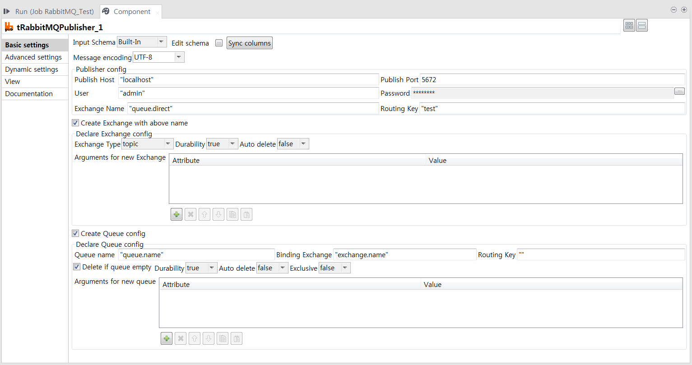
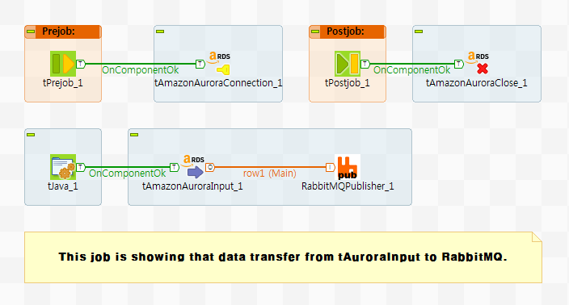

## tRabbitMQPublisher

### Overview
This component contributes to publish message to exchange on RabbitMQ. 
You can also create new exchange and new queue with entered name which is binded with queue and exchange. 
You can configure the appropriate option for exchange and queue like duration, auto-delete, exclusive, routing-key and etc.
It's also able to use arguments for detail operation. If your queue or exchange already exist by RabbitMQ server, you don't need to configure that. 
Message is packed that data of schematic columns will be serialized with header which is specifying length of column data.
Because of using column length header(Integer-4bytes), You don't no more have to use field separator for column.
Each columns is managed by type to support Talend schema type, Therefore you must be complied column type sequence of publisher when you receive data at consumer.
Being to support Talend type, It can able to send object which is Serializable by Java Serializable rule and to send object to consumer.  

If you want to design stream-based architecture which is part of Data-Streamer or DataLake-Synchronizer,
This component is best option for your system.

### Details
To enable to publish message to exchange of RabbitMQ.
To solve field separator in contents by field size header.
To support various Talend schema types.
To create new exchange on RabbitMQ with appropriate options e.g. exchange type(topic, direct, fanout, headers, x-jms-topic), durability, auto-delete...
To create new queue on RabbitMQ with appropriate options e.g. durability, auto-delete, exclusive...
To can use arguments for detail operations.
To make stream-base architecture system.
To be like apart of stream-based Streamer or DataLake-Synchronizer.

### Images

### Install Instructions
Download actifacts.
Exetract the component from zip compressed file to temp folder.
Copy contents of temp folder to TOS components folder where plug-in’s placed.
And then restart TOS.
Dive into.
### Resources
 * <a href=http://www.chaostocosmos.org>Author's page.</a>
 * <a href=https://www.rabbitmq.com/download.html>RabbitMQ download page.</a>
 * <a href=https://www.rabbitmq.com/>RabbitMQ homepage.</a>
 * <a href=https://www.rabbitmq.com/documentation.html>RabbitMQ documentation page.</a>

#### Release Notes

##### 0.90 - 2019-04-23 06:28:13
First draft
Ver 0.90

##### 0.94 - 2019-04-29 02:26:03
=======================================================================
Ver. 0.94 notification.
=======================================================================
1. Support Talend schema types.
2. Adding field length header(Integer 4bytes), No more need to use field separator.
3. Publish/Consume java Object type which can be serialized by Serializable. Anything to be serialized within java object. 

=======================================================================
Ver. 0.91 notification.
=======================================================================
1. Delete exist exchange function when exchange will be created.
2. Delete if exist queue empty option when queue will be created.
##### 0.95 - 2019-07-18 08:30:14
=======================================================================
Ver. 0.95 notification.
=======================================================================
1. Support Talend schema types.
2. Adding field length header(Integer 4bytes), No more need to use field separator.
3. Publish/Consume java Object type which can be serialized by Serializable. Anything to be serialized within java object. 
4. This version must be used with RabbitMQ subscriber Ver. 0.95

=======================================================================
Ver. 0.91 notification.
=======================================================================
1. Delete exist exchange function when exchange will be created.
2. Delete if exist queue empty option when queue will be created.

##### 1.00 - 2019-09-09 00:38:25
=======================================================================
Ver 1.00 notification.
=======================================================================
1. Optional execution with whether field length header or field delimiter.
2. When die no message mode, add function of waiting terminate seconds.  

### Compatible
 -  6.0 (obsolete)
 -   6.1 (obsolete)
 -   6.2 (obsolete)
 -   6.3 (obsolete)
 -   6.4 (obsolete)
 -  6.5 (retired)
 -  7.0 (retired)
 -  7.1 (retired)
 - 7.2