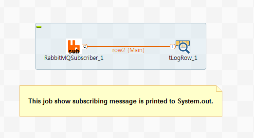

## tRabbitMQSubscriber

### Overview
This component can able to subscribe message from RabbitMQ. 
You can edit and apply schema for message to transform data to using of your needs. 
You can set option for constant run, else if you want to wait for continuous enqueue message, otherwise the component terminate when all message of queue be consumed. 
This component just can be used single for consuming message, but It can be using with tRabbitMQPublisher component a pair.
Because of using column length header(Integer-4bytes), You don't no more have to use field separator for column.
Each columns is managed by type to support Talend schema type, Therefore you must be complied column type sequence of publisher.
As supporting Talend type, It can able to receive object which is Serialized by Java Serializable rule.  

If you want to design stream-based architecture which is part of Data-Streamer or DataLake-Synchronizer,
This component is best option for your system.
### Details
To subscribe data from RabbitMQ.
To support various Talend schema types.
To use of field length header, be solved trouble of field separator in contents.
To edit schema for formal data handling.
To setting option whetheer running constantly or running util all data be consumed.
To use stream-based architecture. Could be consisted of DataLake Synchronizer.
### Images

### Install Instructions
Download actifacts.
Exetract the component from zip compressed file to temp folder.
Copy contents of temp folder to TOS components folder where plug-in’s placed.
And then restart TOS.
Dive into.
### Resources
 * <a href=https://www.rabbitmq.com/>RabbitMQ homepage.</a>
 * <a href=http://www.chaostocosmos.org/>Author's page</a>
 * <a href=https://www.rabbitmq.com/download.html>RabbitMQ download page.</a>
 * <a href=https://www.rabbitmq.com/documentation.html>RabbitMQ Documentation page.</a>

#### Release Notes

##### 0.95 - 2019-07-18 02:58:36
=======================================================================
Ver. 0.95 notification.
=======================================================================
1. Support Talend schema types.
2. Adding field length header(Integer 4bytes), No more need to use field separator.
3. Publish/Consume java Object type which can be serialized by Serializable. Anything to be serialized within java object.  
4. This version must be used with RabbitMQ publisher Ver. 0.95

##### 1.00 - 2019-09-09 00:39:03
=======================================================================
Ver 1.00 notification.
=======================================================================
1. Optional execution with whether field length header or field delimiter.
2. When die no message mode, add function of waiting terminate seconds. 

##### 1.02 - 2019-11-11 00:59:55
1. To add virtual host configuration.
2. Message recive logic is changed that from the way of interanl queuing whole message to process on one by one.
##### 1.03 - 2020-01-07 07:23:37
bug fix - 20200107 - to enable to use variables in fields. It must be with double quotes.
### Compatible
 -  6.0 (obsolete)
 -   6.1 (obsolete)
 -   6.2 (obsolete)
 -   6.3 (obsolete)
 -   6.4 (obsolete)
 -  6.5 (retired)
 -  7.0 (retired)
 -  7.1 (retired)
 - 7.2