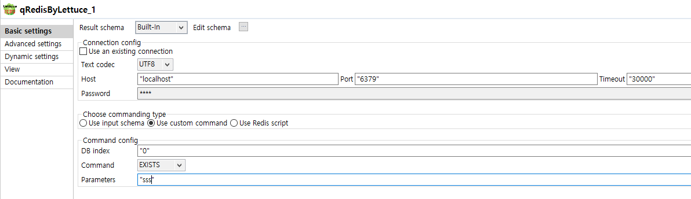
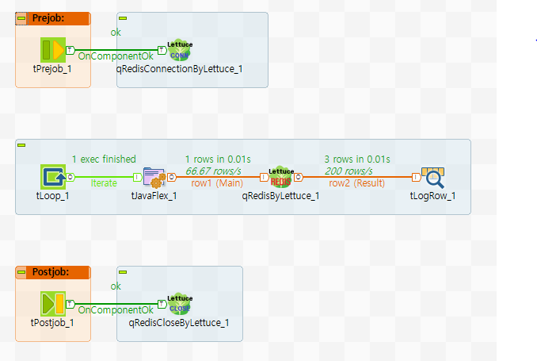

## tRedisByLettuce

### Overview
This component set is able to command on Redis server.
You can do Redis command with input schema line or custom commanding. 
Additionally if you choosen script mode, you can compose with Lua script on editor.
Also you can use Connection/Close component saparately.

Output data structure is providing for List type

### Details
* Be able to use input schema commanding.
* Be able to use custom commanding.
* Be able to use Lua script on editor.
* Because of using separate Connection/Close, you can command multiply as you need.
*
### Images

### Install Instructions
Download actifacts.
Exetract the component from zip compressed file to temp folder.
Copy contents of temp folder to TOS components folder where plug-in’s placed.
And then restart TOS.
Dive into.
### Resources
 * <a href=https://redis.io/>Redis</a>
 * <a href=https://lettuce.io/>Lettuce</a>
 * <a href=https://en.wikipedia.org/wiki/Lettuce>Lettuce wiki</a>
 * <a href=https://en.wikipedia.org/wiki/Redis>Redis</a>

#### Release Notes

##### 0.93 - 2019-12-19 05:14:42
Draft of this component.
##### 0.94 - 2020-01-02 04:05:07
20200102 patch - to change output line data structure.
### Compatible
 -  6.0 (obsolete)
 -   6.1 (obsolete)
 -   6.2 (obsolete)
 -   6.3 (obsolete)
 -   6.4 (obsolete)
 -  6.5 (retired)
 -  7.0 (retired)
 -  7.1 (retired)
 - 7.2